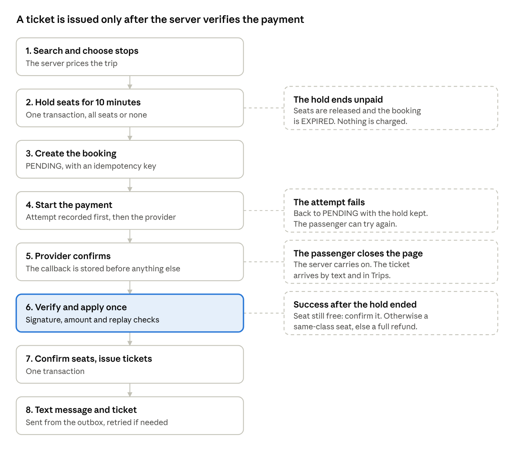
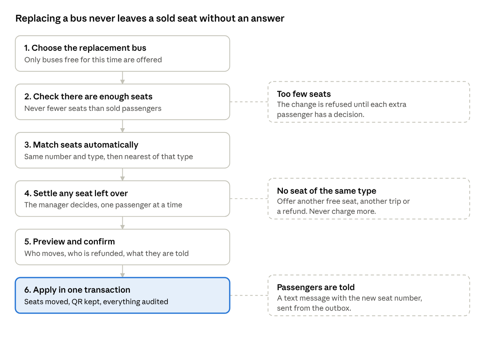
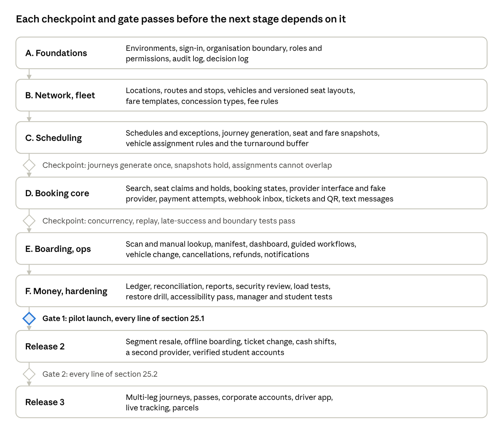

# Ghana Student Transport Booking & Operations Platform: Specification v1.3

Oct 7, 2026 · @Jeffery Essel

## 1. About this version

This is version 1.3 of the specification. It replaces versions 1.0, 1.1
and 1.2 in full. The product concept is unchanged: a single transport
organisation owns its vehicles, routes, schedules, seats, fares and
bookings, and passengers book a real seat on a real departure. It is not
a marketplace.

Version 1.1 exists because a review of 1.0 found a strong vision with
gaps that would have forced an implementation agent to guess. This
version closes them.

**What changed from 1.0.**

| Gap in 1.0                                                                               | Resolution in 1.1                                                                                                                                  |
|------------------------------------------------------------------------------------------|----------------------------------------------------------------------------------------------------------------------------------------------------|
| Section numbers duplicated and cross-references unreliable                               | Renumbered once, in order. Every cross-reference points to a section number                                                                        |
| Seat sales by route segment promised but not modelled                                    | Seat claims with an explicit occupied range and a database-level overlap guarantee (sections 10 and 11)                                            |
| No state machine for journeys, seats, assignments; booking and payment status duplicated | Complete state tables with allowed transitions and one source of truth each (section 9)                                                            |
| Hold expiry during slow mobile money ignored                                             | Hold extension, a payment window, late-success handling and automatic refund (sections 11 and 12)                                                  |
| One ticket per booking although boarding is per person                                   | One ticket per booked seat, with QR rotation (sections 9 and 14)                                                                                   |
| Vehicle substitution with a different layout left as a bullet                            | A defined remapping procedure and impact preview (section 15)                                                                                      |
| Missing tables the rules depend on                                                       | Fare templates, seat claims, payment attempts, webhook inbox, idempotency keys, outbox, ledger, settlements, cash shifts, concessions (section 10) |
| Offline boarding undecided                                                               | Release 1 online with manual fallback; a complete offline design for release 2 (section 14)                                                        |
| Student fares listed as future                                                           | Concession fare types in release 1 (sections 7 and 10)                                                                                             |
| No numbers for performance, availability or concurrency tests                            | Measurable targets and tests (sections 22 and 24)                                                                                                  |
| Open business choices unlisted                                                           | A decision log with defaults (section 2)                                                                                                           |
| Whole platform in one build                                                              | Three releases with gates (sections 4 and 26)                                                                                                      |

**How to read it.** Sections 3 to 8 describe the product. Sections 9 to
18 are the business rules, state machines, data and money logic an
implementation must satisfy. Sections 19 to 22 cover security,
integration and quality targets. Sections 23 to 26 say how to test,
accept and sequence the work. Where a rule says **must**, it is a
requirement. Where it says **default**, the owner may change it through
configuration without a code change.

**Out of scope here.** Legal and regulatory compliance work, including
data protection registration and consumer terms, is owned separately.
This document defines the technical controls that support it: retention
settings, access control, audit and minimal data collection.

### Version 1.2

A further review tested v1.1 against the realities of a financial and
transport system. It found the concepts sound but several places where
an implementation agent would still have to guess, mostly in the
database and transaction contract. Version 1.2 closes them:

| Gap                                                                                                  | Resolution in 1.2                                                                          |
|------------------------------------------------------------------------------------------------------|--------------------------------------------------------------------------------------------|
| Schema had fields and constraints in words, but no types, nullability or delete rules                | Conventions and exact column definitions for the critical tables (sections 10.9 and 10.10) |
| Seat acquisition mechanism not exact. Expired holds could block a new hold under a unique constraint | Lock, release expired claims, then insert, with the invariant stated (section 11.3a)       |
| No single list of things the database must make impossible                                           | Database invariants (section 11.8)                                                         |
| Two people could both confirm boarding for one ticket                                                | Atomic boarding with a concurrency test (sections 14.3a and 24.2)                          |
| No operating procedure for boarding with no signal in release 1                                      | Paper manifest procedure (section 14.7)                                                    |
| Seat matching for a replacement bus was loose                                                        | Formal priority and tie-breaks (section 15.1)                                              |
| Journey generation horizon and one-off departures undefined                                          | Generation rules (decision D23)                                                            |
| Price order, discounts, fees and tax undefined                                                       | Pricing order (section 13.4a)                                                              |
| Student concession had no verification record or expiry                                              | Concession verification record and expiry (D25, section 10.10)                             |
| Ledger left open to interpretation                                                                   | Chart of accounts and posting rules (section 18.3a)                                        |
| Exceptions listed but no exception system                                                            | Exception queue, owners and response times (section 18.6, D27)                             |
| Security written as principles                                                                       | Threat table mapping each threat to a control (section 19.9)                               |
| Service worker behaviour unspecified                                                                 | Cache, update, storage and sign-out contract (section 21.1)                                |
| Build order was layered, not proven by vertical slices                                               | Six vertical slices with acceptance tests (section 26.1)                                   |
| Manager dashboard structure thin                                                                     | Dashboard layout contract (section 8.2a)                                                   |
| Display status mixed commercial and operational facts                                                | Derived display status and rationale for the state split (section 9.10)                    |

### Version 1.3

The owner confirmed that **Paystack** is the payment provider. Version
1.3 replaces every generic provider statement with the Paystack design,
and adds what only a real provider forces: how Paystack's statuses map
to ours, how its webhook is verified, how refunds are routed when a
channel cannot be refunded, how its settlements are reconciled, and the
account setup the owner must complete. The changes are in decisions D11
and D29 to D34, sections 12.6, 13.2a, 13.8, 16.4a, 18.4a, 23.2, 24.8 and
the Paystack readiness lines of 25.1. Paystack's endpoint names and
fields are given for orientation. The implementation follows Paystack's
current published documentation, and a contract test against Paystack's
test mode must prove each mapping before the first live payment.

## 2. Decisions and defaults

These are the business choices an implementation would otherwise have to
guess. Each has a default so work can start, and each is a setting the
owner can change later. The owner confirms or changes each one before
the release it affects. Items marked **owner** are business decisions
and **legal** items are for the separate compliance owner.

| \#  | Decision                                       | Default                                                                                                                                                                                       | Applies from |
|-----|------------------------------------------------|-----------------------------------------------------------------------------------------------------------------------------------------------------------------------------------------------|--------------|
| D1  | How seats are sold along a route               | **Release 1:** a seat is claimed for the whole journey, whatever stops the passenger picks, so a freed segment is not resold. **Release 2:** segment resale, using the same data model        | R1, R2       |
| D2  | Seat hold length                               | 10 minutes from the moment a seat is selected                                                                                                                                                 | R1           |
| D3  | Hold extension for a pending payment           | While a payment is pending, extend until 10 minutes after the payment attempt began, never beyond 20 minutes from first selection                                                             | R1           |
| D4  | Payment arrives after the hold is gone         | Confirm if the same seat is still free. Otherwise offer a seat of the same class on the journey if one is free. Otherwise refund in full, including fees, automatically                       | R1           |
| D5  | Online booking closes                          | 30 minutes before departure. Station agents may sell until departure                                                                                                                          | R1           |
| D6  | Maximum seats per booking                      | 6                                                                                                                                                                                             | R1           |
| D7  | Maximum active holds per person                | 2 bookings, tracked by phone number and account                                                                                                                                               | R1           |
| D8  | Passenger sign-in                              | Phone number with a text-message code. Email optional                                                                                                                                         | R1           |
| D9  | Guest booking                                  | Allowed. A guest finds their ticket with the booking reference plus phone number, then a text code                                                                                            | R1           |
| D10 | Student fares                                  | A concession fare type with a self-declared student number, checked by the conductor against a student ID at boarding. Verified accounts later                                                | R1, R2       |
| D11 | Payment provider                               | Paystack (confirmed by the owner), covering MTN, Telecel and AirtelTigo mobile money and cards, behind a provider interface so another provider can be added later                            | R1           |
| D12 | Station cash                                   | Off in release 1. The data model reserves it                                                                                                                                                  | R2           |
| D13 | Boarding validation                            | Release 1: online, with manual lookup as the fallback. Release 2: offline using a signed manifest (section 14)                                                                                | R1, R2       |
| D14 | Cancellation refund bands (**owner**)          | 24 hours or more before departure: refund the fare, less the provider fee. 6 to 24 hours: 50 percent of the fare. Under 6 hours: no refund. Operator cancellation: 100 percent including fees | R1           |
| D15 | Changing a ticket to another departure         | Allowed up to 6 hours before departure, once, when the new fare is the same or higher, paying only the difference. Lower fares are refunded per D14                                           | R2           |
| D16 | Turnaround buffer between a vehicle's journeys | 60 minutes                                                                                                                                                                                    | R1           |
| D17 | Overbooking                                    | Never                                                                                                                                                                                         | R1           |
| D18 | Revenue is reported as                         | Booked revenue when confirmed, net of refunds, and earned revenue when the journey completes. Both are shown                                                                                  | R1           |
| D19 | Personal data retention (**legal** to confirm) | Passenger details 24 months after the journey. Financial and audit records 7 years                                                                                                            | R1           |
| D20 | Notifications                                  | Text message first. Push and email optional                                                                                                                                                   | R1           |
| D21 | Time zone and currency                         | Africa/Accra and Ghana cedi, stored in pesewas                                                                                                                                                | R1           |
| D22 | Free cancellation of an unpaid booking         | Any time before the hold ends, no charge                                                                                                                                                      | R1           |

The decision log lives in the repository next to the code. A change to a
decision is recorded with who made it and when.

### Added in version 1.2

| \#  | Decision                             | Default                                                                                                                                                                                                                                                                                                                                                                                                                                                          | Applies from |
|-----|--------------------------------------|------------------------------------------------------------------------------------------------------------------------------------------------------------------------------------------------------------------------------------------------------------------------------------------------------------------------------------------------------------------------------------------------------------------------------------------------------------------|--------------|
| D23 | Journey generation                   | A nightly job keeps journeys generated for the next 30 days (a setting). New journeys are created as DRAFT and become SCHEDULED automatically when they have a vehicle assigned, a fare snapshot and no problems. Otherwise they stay DRAFT and appear on the manager's dashboard as "needs a bus". One-off journeys are created by a manager and published the same way. Booking opens at the schedule's booking-open setting, default 30 days before departure | R1           |
| D24 | Late payment and a different seat    | Automatic re-seating is a setting, on by default, and only to a seat of the same class and no higher price, with the passenger told the new seat. Anything else becomes an exception and a full refund. The system never silently moves a passenger to a different class                                                                                                                                                                                         | R1           |
| D25 | Student concession validity          | Valid until the end of the academic year or 12 months, whichever is sooner, then re-verified. Release 1 accepts a self-declared student number, flagged for conductor check and spot audit. Release 2 verifies through the institution or a trusted list                                                                                                                                                                                                         | R1, R2       |
| D26 | Price order                          | Base fare, concession, promotion, fees, rounding (section 13.4a)                                                                                                                                                                                                                                                                                                                                                                                                 | R1           |
| D27 | Exception response times             | Money taken and no ticket: 1 hour. Failed refund or reconciliation mismatch: 4 hours. Everything else: next working day                                                                                                                                                                                                                                                                                                                                          | R1           |
| D28 | Boarding with no signal in release 1 | Printed or exported manifest with manual mark-off and entry after the trip (section 14.7)                                                                                                                                                                                                                                                                                                                                                                        | R1           |

### Added in version 1.3 (Paystack)

| \#  | Decision                 | Default                                                                                                                                                                                                                                                                                                                                 | Applies from |
|-----|--------------------------|-----------------------------------------------------------------------------------------------------------------------------------------------------------------------------------------------------------------------------------------------------------------------------------------------------------------------------------------|--------------|
| D29 | Checkout mode            | Release 1 uses Paystack's hosted checkout: the server initialises a transaction and the passenger completes it in Paystack's popup or redirect page, which offers mobile money and cards. Card details and mobile money prompts never touch our servers. A direct in-app mobile money charge, with our own waiting screen, is release 2 | R1, R2       |
| D30 | Passengers with no email | Paystack needs an email on each transaction. If the passenger gave none, use an organisation-owned address that cannot receive mail (for example the booking reference at a payments subdomain). It is never used for marketing and never shown                                                                                         | R1           |
| D31 | Who bears Paystack's fee | The organisation bears it by default. The passenger-pays setting adds it as a visible fee line (section 13.4a)                                                                                                                                                                                                                          | R1           |
| D32 | Refund routing           | In order: Paystack refund. If Paystack cannot refund that payment method, a Paystack transfer to the passenger's mobile money number. If transfers are not enabled, a manual payout recorded with its reference. The owner confirms with Paystack, in writing and before launch, which channels support refunds in Ghana                | R1           |
| D33 | Settlement               | Paystack settles to the organisation's bank account on Paystack's schedule. Finance reconciles daily against Paystack's transaction and settlement records (section 18.4a)                                                                                                                                                              | R1           |
| D34 | Webhook protection       | Verify the signature on the raw body, accept only from Paystack's published addresses as an extra control, and confirm the payment with a server-side verify call before trusting an amount                                                                                                                                             | R1           |

## 3. Product vision and principles

Build a premium, modern transport booking experience for Ghanaian
passengers, with students as the first audience. The reference is the
clarity of leading travel-booking products, adapted to one organisation
that runs its own buses.

The passenger journey is: search, choose a journey, choose stops, choose
a seat, enter details, pay, receive a ticket, travel.

**Principles.**

1.  **The journey is the central object.** Routes and schedules describe
    planned service. A journey is a real departure on a real date.
    Bookings belong to journeys, never to schedules.

2.  **The server decides.** Availability, price, payment state, ticket
    validity and permissions are decided on the server and enforced by
    the database. The browser only displays.

3.  **No false states.** The product never shows a booking, payment or
    ticket as confirmed when it is not. When something is uncertain, it
    says so plainly and says what happens next.

4.  **History is preserved.** Later changes to schedules, vehicles,
    fares or seat layouts never alter past bookings.

5.  **Explicit state machines.** Every entity with a life cycle has a
    defined set of states and allowed transitions, enforced in one place
    (section 9).

6.  **Built for the weakest realistic moment.** A student on a weak
    mobile connection, on a Friday afternoon, with a bus about to fill.
    Every flow must still work and still be honest.

7.  **Managers are not engineers.** Operators work in business language
    and are protected from dangerous actions (section 8).

8.  **Money must reconcile.** Every pesewa that enters or leaves is
    traceable to a booking, a provider record and a ledger entry
    (sections 13 and 18).

9.  **Security and auditability are product features**, not a later
    hardening step.

10. **Ghana first, extensible later.** Ghana specifics are
    configuration: currency, time zone, payment methods, text-message
    provider. The domain model does not hard-code them.

11. **Premium, not decorative.** Strong typography, clear hierarchy,
    generous space and restrained motion. No generic dashboard look and
    no decorative cards. Every screen has one clear next action.

## 4. Scope and release plan

The platform has three applications on one back end: a passenger app, a
staff boarding app, and an operations and administration app. All three
are installable web apps. Passengers and staff are mobile-first.
Operations has a full desktop experience.

**Explicitly not a marketplace.** No operator comparison, no third-party
inventory, no operator ranking, no marketplace commission, and no
passenger choice of operator. A future multi-operator product would be a
separate product decision.

**Releases.** The platform is built and launched in three releases. A
release is finished only when its gate in section 25 passes. Nothing
from a later release is started in a way that weakens an earlier gate.

| Capability    | Release 1: pilot corridor                                                                               | Release 2: scale                                         | Release 3: growth                 |
|---------------|---------------------------------------------------------------------------------------------------------|----------------------------------------------------------|-----------------------------------|
| Corridors     | One corridor with a handful of stops, for example Accra to Cape Coast                                   | Any number of routes                                     | Multi-leg journeys                |
| Seat sales    | Whole-journey seat claims (D1)                                                                          | Segment resale                                           | Dynamic pricing                   |
| Booking       | Search, stops, seat, pay, ticket, my trips                                                              | Ticket change to another departure (D15), group bookings | Passes and subscriptions          |
| Payment       | Paystack: three mobile money networks and cards                                                         | A second provider, provider switching                    | Corporate and university accounts |
| Station cash  | Off                                                                                                     | Cash shifts, tills, agent float                          | Agent commissions                 |
| Fares         | Standard and student concession fares                                                                   | Verified student accounts, promotions                    | Loyalty                           |
| Boarding      | Online scan, manual fallback, duplicate detection                                                       | Offline scanning with signed manifest                    | Driver app, live tracking         |
| Operations    | Dashboard, guided journey creation, vehicle assignment and safe substitution, cancellations and refunds | Fleet maintenance links, advanced reports                | Parcel and cargo                  |
| Finance       | Reconciliation against the provider, ledger, daily report                                               | Cash reconciliation, settlements automation              | Public API                        |
| Notifications | Text messages for every key event                                                                       | Push and email                                           | WhatsApp                          |

**Why one corridor first.** It lets the organisation prove booking
integrity, payment reliability and boarding speed with real students and
real buses before the complexity of many routes. The data model is
already built for many routes, so scaling is configuration, not
redesign.

## 5. Roles and permission catalogue

Roles and permissions are data. Code checks a named permission, never a
role name. An administrator can create a role by choosing permissions,
without a code change.

| Role                   | Responsibilities                                                | Scope                                                                  |
|------------------------|-----------------------------------------------------------------|------------------------------------------------------------------------|
| Passenger              | Search, book, pay, view tickets, manage own trips               | Own records only                                                       |
| Station Agent          | Assist passengers, look up bookings, board passengers           | Assigned station                                                       |
| Conductor              | Manifest, scanning, boarding, no-show marking                   | Assigned journeys                                                      |
| Driver                 | Journey status and trip information                             | Assigned journeys                                                      |
| Operations Manager     | Routes, schedules, journeys, vehicles, assignments, disruptions | Operational scope                                                      |
| Finance                | Payments, refunds, reconciliation, finance reports              | Financial scope                                                        |
| Support                | Passenger help and controlled booking assistance                | Support scope                                                          |
| Administrator          | Organisation settings, staff and roles                          | Organisation                                                           |
| Platform Administrator | Platform operation when more than one organisation exists       | Platform, no access to organisation money or passenger data by default |

**Authorisation rules.** Every protected operation is authorised on the
server. Organisation boundaries are enforced at the data-access layer.
Station and journey scope restricts what a staff member can see.
High-risk permissions are separate and audited. Hidden buttons are never
the only protection.

**Permission catalogue.** Defaults are shown. An organisation may change
them.

| Permission               | Allows                                         | Default roles                              |
|--------------------------|------------------------------------------------|--------------------------------------------|
| booking.create.own       | Book as oneself                                | Passenger                                  |
| booking.view.own         | See own bookings and tickets                   | Passenger                                  |
| booking.create.station   | Sell a booking at a station                    | Station Agent                              |
| booking.view.scope       | See bookings in scope                          | Station Agent, Support, Operations Manager |
| booking.cancel.scope     | Cancel a booking in scope                      | Support, Operations Manager                |
| booking.override         | Override a rule, with a reason                 | Operations Manager                         |
| ticket.scan              | Scan and board                                 | Conductor, Station Agent                   |
| ticket.board.manual      | Board by manual lookup                         | Conductor, Station Agent                   |
| ticket.override.board    | Board against a failed check, with a reason    | Operations Manager                         |
| journey.view.assigned    | See assigned journeys and manifest             | Conductor, Driver                          |
| journey.update.status    | Record departure, arrival, delay               | Conductor, Driver, Operations Manager      |
| journey.create           | Create or generate journeys                    | Operations Manager                         |
| journey.cancel           | Cancel a journey                               | Operations Manager                         |
| vehicle.assign           | Assign or substitute a vehicle                 | Operations Manager                         |
| fleet.manage             | Vehicles and seat layouts                      | Operations Manager                         |
| route.manage             | Locations, routes, stops                       | Operations Manager                         |
| schedule.manage          | Schedules and exceptions                       | Operations Manager                         |
| fare.manage              | Fare templates and concession types            | Operations Manager, Administrator          |
| payment.view             | See payments                                   | Finance, Support (limited)                 |
| refund.request           | Request a refund                               | Support, Operations Manager, Finance       |
| refund.approve           | Approve a refund                               | Finance                                    |
| finance.reconcile        | Run and sign off reconciliation                | Finance                                    |
| finance.export           | Export financial data                          | Finance (audited)                          |
| passenger.export         | Export passenger lists                         | Operations Manager (audited)               |
| staff.manage             | Invite and deactivate staff                    | Administrator                              |
| role.manage              | Change roles and permissions                   | Administrator                              |
| settings.manage          | Organisation settings and decision-log values  | Administrator                              |
| audit.view               | Read the audit log                             | Administrator, Finance                     |
| notification.send.manual | Send a manual notice to a journey's passengers | Operations Manager                         |

Permissions in the high-risk group are refund.approve, finance.export,
passenger.export, role.manage, booking.override, ticket.override.board
and journey.cancel. These require a fresh confirmation (re-entering a
code) at the moment of use, and are always written to the audit log with
the reason given.

## 6. Information architecture

Each application has a short, stable set of top-level areas. Staff and
passenger apps use a bottom bar on phones. Operations uses a side menu
on desktop and collapses to a menu on tablets.

| Passenger app             | Staff boarding app | Operations app             |
|---------------------------|--------------------|----------------------------|
| Home (search)             | Today              | Today (dashboard)          |
| Results                   | My journeys        | Journeys                   |
| Stops                     | Scan               | Schedules                  |
| Seat selection            | Manifest           | Routes and stops           |
| Passenger details         | Journey status     | Fleet                      |
| Review and payment        | Profile            | Bookings                   |
| Ticket                    |                    | Payments and refunds       |
| Trips (upcoming and past) |                    | Staff and roles            |
| Account and notifications |                    | Notifications              |
|                           |                    | Reports and reconciliation |
|                           |                    | Audit log                  |
|                           |                    | Settings                   |

Navigation is configuration, not a dependency. No feature may rely on a
particular tab order, so the structure can change after real usage
without rewriting features.

## 7. Passenger experience

### 7.1 Visual direction

Premium, modern, youthful and credible. Mobile-first without making
desktop look like an enlarged phone. Strong typography, clear hierarchy,
generous whitespace, restrained motion. Real transport photography only
where it builds trust. Primary actions are obvious and reachable with
one thumb. Every screen has a clear next action, and detail is revealed
progressively.

### 7.2 Home and search

Search is the dominant element: origin, destination, date, and
passengers (1 to the D6 limit). Origins and destinations come from a
controlled list of locations, never free text. A signed-in passenger
sees their upcoming trip first. Recent routes are offered. A support
contact is always one tap away. The install prompt appears only after a
first successful booking.

If nothing matches, the screen says why (no service that day, sold out,
booking closed) and suggests the nearest alternatives: the same route on
adjacent days, or a nearby boarding point. Entered search details
survive navigation and network failures.

### 7.3 Results

Each result shows origin and destination, departure and expected
arrival, duration, boarding location, vehicle class where relevant,
seats remaining, fare, a Select button, and any delay or cancellation.
It never shows operator comparison, because there is one operator.

### 7.4 Boarding point and destination

Stops are shown in route order with times. A destination cannot be
chosen before the boarding point. Only combinations the route allows are
offered. The authoritative fare is recalculated by the server whenever
stops change, and the change is shown before the passenger continues.

### 7.5 Seat selection

The screen draws the real vehicle layout with seat numbers. Seats are
available, selected, held by someone else, taken, blocked, premium or
accessible. **State is never shown by colour alone**: each state has a
distinct shape or label, and every seat has a text label for screen
readers.

Premium seat prices are shown on the seat. A visible countdown shows the
hold, with the explanation "This seat is yours for 10 minutes while you
pay." The server is authoritative: if a chosen seat has just been taken,
the screen says so and offers the nearest free seat of the same class.

### 7.6 Passenger details

For each traveller: full name (required), phone (required), fare type
(standard or student), student number when the student fare is chosen,
optional email, optional emergency contact. A passenger may book for
others. The purchaser and each traveller are separate records. Data
collected is the minimum needed. Guest booking is allowed (D9).

When the student fare is chosen, the screen says plainly that the
student ID will be checked at boarding.

### 7.7 Review and payment

The review shows journey, date, boarding point, destination, each
passenger and seat, each fare, fees, total, the cancellation and refund
policy in plain words (D14), the payment method, and the consent the
organisation requires.

After payment is started the screen shows an honest waiting state:
"Approve the payment on your phone. This can take a minute." It shows
the hold countdown and, while payment is pending, that the hold is being
kept. It must never say "paid" until the server has confirmed. Returning
from a provider page or closing the browser proves nothing. If the
passenger leaves, the booking continues server-side and the ticket
arrives by text message and in Trips when payment is confirmed.

### 7.8 Ticket

One ticket per seat (section 14). Each shows booking reference, ticket
number, passenger name, origin and destination, boarding point, date,
departure, seat, fare type, status, a QR code, support contact and
boarding instructions. The QR contains only an opaque credential. A
ticket can be saved for offline viewing, and a text message carries a
link and a short boarding code as a fallback when the phone is dead or
the data is gone.

### 7.9 Trips and account

Trips shows upcoming and past journeys, with cancel and refund where
permitted. Account holds profile, sign-in details, notification choices
and saved passengers. Sign-in is by phone number with a text code (D8).

## 8. Operator experience

Managers, station supervisors, finance staff and administrators are
non-technical business users. They must run the system with confidence
without understanding databases, identifiers, interfaces, payment
callbacks or deployment. The system carries the complexity of
concurrency, payment verification, seat integrity, permissions and
recovery.

### 8.1 Business language

Operational screens use transport and business words only. Internal
identifiers never appear. A journey is "Accra to Cape Coast, Friday 16
October, 10:00 AM". Availability is "8 seats available". A failed
provider callback is "Payment needs attention". A technical diagnostic
view exists only for authorised support staff and is clearly separate.

### 8.2 The dashboard answers one question

"What needs my attention today?" In priority order: departures today and
the next departure, journeys with no bus assigned, a bus change that
needs a decision, journeys selling slowly or full, payments needing
attention, refunds waiting for a decision, cancellations, disruptions
and delays, staff not yet assigned, and boarding progress for journeys
under way. Each item has the action beside it, so the manager can act
from the dashboard. Decorative charts are not part of the dashboard.

### 8.2a Dashboard layout contract

The dashboard has three bands in this order. On a phone they stack in
the same order.

| Band                        | Contents                                                                                                                                                                                                                                                                             |
|-----------------------------|--------------------------------------------------------------------------------------------------------------------------------------------------------------------------------------------------------------------------------------------------------------------------------------|
| Needs attention (top)       | The exception queue (section 18.6): each item shows what happened, how urgent, who owns it, and one button for the next action. Examples: "Bus missing: Accra to Cape Coast, 08:00", "2 payments need attention", "1 passenger needs a seat after a bus change", "4 refunds waiting" |
| Today (middle)              | Every departure today in time order: time, route, bus, seats sold out of seats, boarding progress, and status shown as words and symbols. Selecting one opens its manifest, bus, staff and events. Journeys with a problem sort to the top                                           |
| Performance (bottom, quiet) | Seats sold today, occupancy of today's departures, booked revenue today, passengers boarded, refunds owed. No decorative charts                                                                                                                                                      |

Quick actions beside the bands: create a departure, assign a bus, view
today's passengers, look up a booking. Anything not needing action stays
out of the top band.

### 8.3 Guided workflows

Configuration is a guided sequence with sensible defaults, plain
explanations and progressive disclosure, not a database form. Creating a
service walks through route, stops, date and time, bus, fare, and
booking rules. Creating a route walks through stops in order, then times
between stops, then which stops allow boarding and drop-off. Each guide
ends with a plain summary of what passengers will see.

### 8.4 Safe by default

The system prevents technically valid but operationally dangerous
actions, and before any high-impact action it explains what will happen
and who is affected.

| Action                                       | What the system must do                                                                                      |
|----------------------------------------------|--------------------------------------------------------------------------------------------------------------|
| Delete a bus with future bookings            | Refuse. Offer to retire it from new journeys instead                                                         |
| Assign a bus to overlapping journeys         | Refuse, showing the clash and the 60 minute turnaround rule                                                  |
| Replace a bus with fewer seats than are sold | Refuse until each passenger has a place, then show the remapping preview (section 15)                        |
| Create a duplicate departure                 | Warn and ask to confirm that two services are intended                                                       |
| Change a fare on a journey already on sale   | Apply to new bookings only, state that existing tickets keep their fare, and ask for confirmation            |
| Cancel a journey with passengers             | Show how many, the refund total, the text message passengers will receive, and require explicit confirmation |
| Refund more than the refundable amount       | Refuse                                                                                                       |
| Change a seat layout used by booked journeys | Refuse. Offer a new layout version for future journeys                                                       |

### 8.5 Plain-English confirmation and recovery

Confirmations state the business consequence. Errors say what went
wrong, whether the work was saved, and what to do next. Never "500
error", "mutation failed" or "invalid foreign key". Example: "We could
not save the bus because another departure uses it at that time. Choose
another bus or change the departure time. Nothing has been changed."

### 8.6 Operations screens

- **Journeys:** route, date, scheduled and actual times, assigned bus,
  seats sold and free, manifest, boarding progress, assigned staff,
  status, events and notes.

- **Fleet:** registration, fleet number, type, make and model, capacity,
  seat-layout version, status, notes.

- **Routes:** origin and destination, ordered stops, times between
  stops, who may board and leave at each stop, estimated duration,
  distance.

- **Schedules:** days, departure time, duration, fare template, booking
  open and close, default bus, active or paused, and date exceptions
  such as public holidays.

- **Fares:** fare templates by stop pair, premium seat prices, student
  concession, fees.

### 8.7 Help in context

First-use guidance, tooltips and short explanations for unfamiliar
actions. Training explains the business task, never the software
internals.

### 8.8 Manager usability test

Before a release is accepted, representative non-technical staff
complete these tasks after a short orientation and with no developer
help: create a route, add boarding points, create a departure, assign a
bus, set a fare, view today's passengers, find free seats, change a bus
safely, manage a cancellation, understand a refund, check a payment, and
read the dashboard.

Pass mark: at least 90 percent of attempts succeed unaided, the median
time for creating a departure is under 4 minutes, no participant needs
an internal identifier or a technical term explained, and every error
message is judged understandable by at least 90 percent of participants.
Completion time, errors and confusion points are recorded. A feature
that fails is not done.

## 9. Domain model and state machines

The core chain is: route, schedule, journey, booking, ticket, boarding.
A route describes a corridor. A schedule describes recurring intent. A
journey is a real, dated departure. A booking always belongs to a
journey. A ticket belongs to one booked seat. Boarding is recorded per
ticket.

### 9.1 Rules for every state machine

1.  Each entity below has a fixed set of states and a fixed set of
    allowed moves.

2.  A move happens only through one domain function per entity. No other
    code writes a status.

3.  The database refuses an illegal move (a check or a trigger), as a
    second line of defence.

4.  Every move writes an event with who, when and why. Moves made by the
    system record the system as the actor.

5.  Each fact has exactly one source of truth. Anything shown that can
    be derived (for example "payment status" on a booking) is derived,
    never stored twice.

### 9.2 Journey

Delay is an event with a number of minutes. It does not change the
state.

| State        | Meaning                                | Allowed next states               |
|--------------|----------------------------------------|-----------------------------------|
| DRAFT        | Generated or created, not yet for sale | SCHEDULED, CANCELLED              |
| SCHEDULED    | On sale                                | SALES_CLOSED, BOARDING, CANCELLED |
| SALES_CLOSED | Online booking closed (D5)             | BOARDING, CANCELLED               |
| BOARDING     | Boarding has started                   | DEPARTED, CANCELLED               |
| DEPARTED     | Left the first stop                    | COMPLETED                         |
| COMPLETED    | Reached the final stop                 | None                              |
| CANCELLED    | Called off                             | None                              |

Cancelling any journey that has confirmed tickets starts the disruption
procedure in section 15.

### 9.3 Booking

| State           | Meaning                                      | Allowed next states                                           |
|-----------------|----------------------------------------------|---------------------------------------------------------------|
| PENDING         | Seats held, no payment started               | PAYMENT_PENDING, EXPIRED, CANCELLED                           |
| PAYMENT_PENDING | A payment attempt is in progress             | CONFIRMED, PENDING (attempt failed, hold still live), EXPIRED |
| CONFIRMED       | Paid and seats committed                     | COMPLETED, CANCELLED                                          |
| EXPIRED         | Hold ended without payment                   | None                                                          |
| CANCELLED       | Every seat cancelled                         | None                                                          |
| COMPLETED       | Journey completed with the booking confirmed | None, except a recorded correction                            |

Partial cancellation, no-show and refund are not booking states. They
are facts about a seat or a payment, below.

### 9.4 Booked seat

| State     | Meaning                            | Allowed next states                |
|-----------|------------------------------------|------------------------------------|
| HELD      | Held for this booking              | CONFIRMED, EXPIRED, CANCELLED      |
| CONFIRMED | Paid                               | BOARDED, NO_SHOW, CANCELLED        |
| BOARDED   | Passenger boarded                  | None                               |
| NO_SHOW   | Journey left without them          | None, except a recorded correction |
| CANCELLED | Cancelled by passenger or operator | None                               |
| EXPIRED   | Hold ended                         | None                               |

A booking with some seats cancelled stays CONFIRMED. It becomes
CANCELLED only when every seat is cancelled.

### 9.5 Seat claim (inventory)

A seat claim is what actually occupies a seat (section 11).

| State     | Allowed next states            |
|-----------|--------------------------------|
| HELD      | CONFIRMED, RELEASED            |
| CONFIRMED | RELEASED (cancellation, remap) |
| RELEASED  | None                           |

A journey seat itself is BOOKABLE or BLOCKED. Blocking is an operator
decision, such as a broken seat, and it never changes an existing
confirmed claim without the section 15 procedure.

### 9.6 Payment attempt, payment, refund

| Entity          | States                                                       | Notes                                                                                                                                                                            |
|-----------------|--------------------------------------------------------------|----------------------------------------------------------------------------------------------------------------------------------------------------------------------------------|
| Payment attempt | INITIATED, PENDING, SUCCEEDED, FAILED, EXPIRED               | INITIATED is internal, before the provider accepts. PENDING means the provider accepted and is waiting for the passenger. A booking may have several attempts                    |
| Payment         | RECEIVED, REVERSED                                           | Created when an attempt SUCCEEDS. Holds a running refunded amount, so "partly refunded" is derived and never stored as a state                                                   |
| Refund          | REQUESTED, APPROVED, PROCESSING, COMPLETED, FAILED, REJECTED | Automatic refunds (operator cancellation, lost seat after late payment) go straight to APPROVED with the system as approver. FAILED refunds are retried and escalated to Finance |

### 9.7 Ticket

| State     | Allowed next states                             |
|-----------|-------------------------------------------------|
| VALID     | BOARDED, CANCELLED, EXPIRED, REPLACED           |
| BOARDED   | None                                            |
| CANCELLED | None                                            |
| EXPIRED   | None                                            |
| REPLACED  | None (a new credential replaced it, section 14) |

### 9.8 Vehicle assignment

ACTIVE, REPLACED, CANCELLED. A journey has at most one ACTIVE assignment
at any time, enforced by the database.

### 9.9 Entities

| Entity                                    | Purpose                                |
|-------------------------------------------|----------------------------------------|
| Organisation                              | Operator boundary                      |
| User, Role, Permission                    | Identity and authorisation             |
| Location                                  | Terminal, station or stop              |
| Route, Route stop                         | Ordered corridor                       |
| Vehicle, Seat layout, Seat                | Physical bus and versioned layout      |
| Fare template, Fare rule, Concession type | How fares are built                    |
| Schedule                                  | Recurring plan                         |
| Journey                                   | Actual dated departure                 |
| Vehicle assignment                        | Which bus operates a journey           |
| Journey fare                              | Fare snapshot                          |
| Journey seat                              | Seat snapshot for one journey          |
| Seat claim                                | What occupies a seat, over which stops |
| Booking, Booking passenger, Booked seat   | The reservation                        |
| Payment attempt, Payment, Refund          | Money in and out                       |
| Webhook event, Idempotency key            | Safe handling of retries               |
| Ticket, Boarding record                   | Credential and evidence                |
| Journey event, Journey staff              | Operations                             |
| Notification, Delivery, Outbox            | Messages                               |
| Ledger entry, Settlement                  | Finance                                |
| Cash shift, Cash receipt                  | Station cash (release 2)               |
| Audit log                                 | Trace of privileged changes            |

### 9.10 Display status, and why the states are split

A booking, a booked seat and a payment are different things, so their
states are separate. A booking is a commercial record. A seat has its
own life (held, boarded, no-show, cancelled). A payment has its own
(received, refunded). Folding them into one status would make a group
booking with one cancelled seat and one boarded seat impossible to
describe.

What the passenger and staff see is a **display status**, computed from
the three and never stored:

| Display status               | Computed when                                                           |
|------------------------------|-------------------------------------------------------------------------|
| Waiting to pay               | Booking PENDING                                                         |
| Payment in progress          | Booking PAYMENT_PENDING                                                 |
| Confirmed                    | Booking CONFIRMED and every seat CONFIRMED                              |
| Partly cancelled             | Booking CONFIRMED and at least one seat CANCELLED                       |
| Travelled                    | Booking COMPLETED, with the seats BOARDED                               |
| Missed                       | A seat is NO_SHOW                                                       |
| Cancelled                    | Booking CANCELLED, and no refund is owed                                |
| Cancelled, refund on its way | Booking CANCELLED with a refund REQUESTED, APPROVED or PROCESSING       |
| Cancelled and refunded       | Booking CANCELLED with refunds COMPLETED for the full refundable amount |
| Expired                      | Booking EXPIRED                                                         |

### 9.11 Exception

An exception is a case that needs a person. States: OPEN, ACKNOWLEDGED,
IN_PROGRESS, RESOLVED, DISMISSED. DISMISSED requires a reason. An
exception can resolve itself when its cause clears (for example a late
refund completes), which is recorded.

## 10. Data model

This is the logical model. Names may follow local convention. Every
organisation-owned table carries organisation_id and enforces the
organisation boundary in the data layer. All money is stored in whole
pesewas as integers, with the currency. All times are stored in UTC and
shown in the organisation time zone. Foreign keys are enforced. Records
that carry money, tickets or audit history are never deleted.

### 10.1 Organisation, people, access

| Table                                            | Key fields                                                   | Constraints and notes                                                                                 |
|--------------------------------------------------|--------------------------------------------------------------|-------------------------------------------------------------------------------------------------------|
| organisations                                    | name, slug, logo, phone, email, currency, timezone, status   | slug unique                                                                                           |
| users                                            | auth identity, organisation, full name, phone, email, status | Phone unique per organisation. Auth identity unique. A user never stores a role directly              |
| roles, permissions, user_roles, role_permissions | role name, permission code, scope type and scope reference   | Permission codes are the catalogue in section 5. Scope can be an organisation, a station or a journey |
| settings                                         | organisation, key, value, changed by, changed at             | Holds every decision-log value (section 2). Each change is audited                                    |

### 10.2 Network and fleet

| Table                | Key fields                                                                                      | Constraints and notes                                                                                                |
|----------------------|-------------------------------------------------------------------------------------------------|----------------------------------------------------------------------------------------------------------------------|
| locations            | name, type, city, region, address, coordinates, description, contact, active                    | Controlled list. Used for search, never free text                                                                    |
| routes               | name, origin, destination, estimated duration, distance, status                                 | Origin and destination must equal the first and last stop                                                            |
| route_stops          | route, location, sequence, arrival offset, departure offset, boarding allowed, drop-off allowed | Unique (route, sequence). Offsets non-decreasing. The first stop allows boarding only. The last allows drop-off only |
| vehicles             | registration, fleet number, name, type, make, model, year, capacity, status                     | Registration unique per organisation. Status active, in maintenance or retired                                       |
| vehicle_seat_layouts | vehicle, version, name, rows, columns, active                                                   | A layout used by any booked or completed journey is immutable. A structural change creates a new version             |
| seats                | layout, seat number, row, column, seat type, position, bookable                                 | Unique (layout, seat number). Seat types: standard, premium, accessible                                              |

### 10.3 Fares

| Table            | Key fields                                                                                 | Constraints and notes                                                                                        |
|------------------|--------------------------------------------------------------------------------------------|--------------------------------------------------------------------------------------------------------------|
| fare_templates   | name, route, active                                                                        | The default fare plan for a route                                                                            |
| fare_rules       | template, origin stop, destination stop, seat type, base amount                            | Unique per template, stop pair and seat type. Amount positive. Destination after origin                      |
| concession_types | name (for example Student), discount kind and value, requires reference, check at boarding | Applied by the server. The student number is stored on the passenger, never trusted for the price on its own |
| fee_rules        | name, kind (fixed or percent), value, applies to, rounding                                 | Service fees. Rounding is to the pesewa, half up, applied once per booking and shown to the passenger        |

### 10.4 Schedules and journeys

| Table               | Key fields                                                                                                                    | Constraints and notes                                                                                                                                |
|---------------------|-------------------------------------------------------------------------------------------------------------------------------|------------------------------------------------------------------------------------------------------------------------------------------------------|
| schedules           | route, name, departure time, days of week, default vehicle, fare template, booking open and close rules, status, version      | Edits create a new version that applies to journeys not yet generated or not yet booked (section 23)                                                 |
| schedule_exceptions | schedule, date, kind (skip, move, extra), new time                                                                            | Holidays and one-off changes                                                                                                                         |
| journeys            | route, schedule (nullable), service date, scheduled departure and arrival, actual departure and arrival, delay minutes, state | Unique (schedule, service date) so generation cannot duplicate. States per section 9                                                                 |
| vehicle_assignments | journey, vehicle, assigned by, reason, state                                                                                  | At most one ACTIVE per journey. No two ACTIVE assignments for one vehicle with overlapping time plus the turnaround buffer, enforced by the database |
| journey_fares       | journey, origin stop, destination stop, seat type, amount                                                                     | Copy of the fare rules when the journey was published. Never changed for existing bookings                                                           |
| journey_seats       | journey, layout seat reference, seat number, seat type, state BOOKABLE or BLOCKED                                             | Snapshot at journey creation, so later layout changes cannot touch history                                                                           |
| journey_events      | journey, event type, recorded by, location, time, notes                                                                       | Boarding started, departed, delayed (with minutes), stop reached, arrived, cancelled, vehicle changed                                                |
| journey_staff       | journey, user, role, assigned, removed                                                                                        | A person cannot be on two journeys that overlap in time                                                                                              |

### 10.5 Seats, bookings, tickets

| Table              | Key fields                                                                                                                                             | Constraints and notes                                                                                                                                        |
|--------------------|--------------------------------------------------------------------------------------------------------------------------------------------------------|--------------------------------------------------------------------------------------------------------------------------------------------------------------|
| seat_claims        | journey seat, occupied from stop sequence, occupied to stop sequence, state, expires at, booked seat                                                   | The database guarantees that no two active claims on one journey seat overlap in their occupied range (section 11). Claims in the RELEASED state are ignored |
| bookings           | journey, user (nullable for guests), purchaser name and phone, reference, state, total, currency, source (passenger app, station, support), expires at | Reference unique and non-guessable. Total equals the sum of seat fares plus fees                                                                             |
| booking_passengers | booking, full name, phone, email, fare type, student number, emergency contact                                                                         | Separate from the purchaser                                                                                                                                  |
| booked_seats       | booking, journey, journey seat, passenger, origin stop, destination stop, fare, fee share, state, seat claim                                           | The fare and stops are the sold values and never recalculated                                                                                                |
| tickets            | booked seat, ticket number, state, issued at                                                                                                           | One per booked seat. Ticket number unique                                                                                                                    |
| ticket_credentials | ticket, token hash, issued at, revoked at, reason                                                                                                      | The QR token is never stored, only its hash. Rotation creates a new row and revokes the old one                                                              |
| boarding_records   | ticket, journey, boarded at, boarded by, boarding location, method (scan, manual, override), device                                                    | At most one per ticket. Duplicate scan attempts go to the audit log, not here                                                                                |

### 10.6 Payments, refunds, finance

| Table                         | Key fields                                                                                                                   | Constraints and notes                                                                                           |
|-------------------------------|------------------------------------------------------------------------------------------------------------------------------|-----------------------------------------------------------------------------------------------------------------|
| payment_attempts              | booking, internal attempt id, provider, provider reference, amount, currency, method, state, started, ended, failure reason  | Created before the provider is called. Internal attempt id unique and sent to the provider                      |
| payments                      | attempt, booking, amount, currency, received at, refunded amount, state, provider fee                                        | Created only from a SUCCEEDED attempt. Refunded amount never exceeds amount                                     |
| webhook_events                | provider, provider event id, raw body, signature verified, received at, processed at, outcome                                | Unique (provider, provider event id). Stored before any processing (inbox pattern)                              |
| idempotency_keys              | key, operation, request hash, response, created                                                                              | A repeated key returns the first result. A repeated key with a different request is refused                     |
| refunds                       | payment, booking, booked seat (nullable), amount, reason, state, provider reference, requested by, approved by, processed at | Amount is capped by the refundable remainder, enforced by the database                                          |
| ledger_entries                | entry date, kind, booking, payment, amount, currency, direction, reference                                                   | Append-only. Kinds: passenger payment, provider fee, refund, cash receipt, cash deposit, settlement, adjustment |
| settlements, settlement_lines | provider, period, expected, received, status, lines matched to payments                                                      | Used by reconciliation (section 18)                                                                             |
| cash_shifts, cash_receipts    | station, agent, opened, closed, float, counted total, variance                                                               | Release 2. Cash and digital stay separate                                                                       |

### 10.7 Messages and trace

| Table                   | Key fields                                                                                                      | Constraints and notes                                                                                                           |
|-------------------------|-----------------------------------------------------------------------------------------------------------------|---------------------------------------------------------------------------------------------------------------------------------|
| notifications           | event type, subject, recipient, template, created                                                               | One logical message                                                                                                             |
| notification_deliveries | notification, channel, state, provider reference, attempts, last error                                          | One row per channel attempt, retried independently                                                                              |
| outbox                  | event type, payload, created, processed at                                                                      | Written in the same transaction as the change that caused it, so a message is never lost or sent for something that rolled back |
| audit_logs              | organisation, actor, action, entity type, entity reference, before, after, reason, source address, device, time | Append-only. Sensitive fields masked in before and after values. Ordinary users cannot edit or delete                           |

### 10.8 Integrity and indexes

Unique constraints on booking reference, ticket number, registration
number per organisation, and (schedule, service date). Checks for
positive amounts, valid capacities and dates. Indexes follow actual
query paths: journeys by date, state and route; bookings by reference,
user and journey; payment attempts by provider reference; webhook events
by provider event id; tickets by credential hash; boarding by journey;
seat claims by journey seat and expiry; vehicle assignments by vehicle
and time.

### 10.9 Schema conventions

These apply to every table. The column tables in 10.10 follow them.

| Topic            | Rule                                                                                                                                                                                                                                                                                                                                                                                                       |
|------------------|------------------------------------------------------------------------------------------------------------------------------------------------------------------------------------------------------------------------------------------------------------------------------------------------------------------------------------------------------------------------------------------------------------|
| Identifiers      | uuid, time-ordered, generated by the database. Never exposed to people. Human-facing references are separate, random and non-guessable                                                                                                                                                                                                                                                                     |
| Money            | bigint whole pesewas plus a currency of char(3). Never floating point. Amounts that must be positive have a check                                                                                                                                                                                                                                                                                          |
| Time             | timestamptz in UTC. Names ending \_at are instants. A date of service is a date in the organisation's zone and is named service_date                                                                                                                                                                                                                                                                       |
| Nullability      | Every column is NOT NULL unless 10.10 marks it nullable, and each nullable column states what null means                                                                                                                                                                                                                                                                                                   |
| Enumerations     | A text column with a check constraint listing the states in section 9, or a native enumeration. Never free text                                                                                                                                                                                                                                                                                            |
| Tenant ownership | Every organisation-owned table has organisation_id uuid NOT NULL and a unique key on (organisation_id, id). Every foreign key between organisation-owned tables is composite and includes organisation_id, so a row cannot point at another organisation's data. Row-level security restricts every such table to the organisation set for the request, as a second line of defence behind the application |
| Delete rules     | ON DELETE RESTRICT throughout. No cascading deletes anywhere. People and vehicles are deactivated, never deleted. Money, tickets, boarding, webhook and audit rows are never deleted by anything                                                                                                                                                                                                           |
| Immutable tables | Ledger, audit, webhook raw bodies and boarding records refuse update and delete, enforced by the database for every role                                                                                                                                                                                                                                                                                   |
| Audit columns    | created_at default now, set by the database. updated_at set by a trigger. created_by where a person acts                                                                                                                                                                                                                                                                                                   |
| Concurrency      | State columns are changed with a conditional update (WHERE id = ? AND state = \<expected\>) and the affected row count is checked. A mismatch means someone else moved it first and the operation fails cleanly                                                                                                                                                                                            |
| Indexes          | Each table lists the indexes it must have. Unique indexes that enforce a business rule are constraints, not optional performance aids                                                                                                                                                                                                                                                                      |

### 10.10 Critical table definitions

**journeys**

| Column                                       | Type        | Null | Rule                                           |
|----------------------------------------------|-------------|------|------------------------------------------------|
| id, organisation_id                          | uuid        | no   | Primary key (id). Unique (organisation_id, id) |
| route_id                                     | uuid        | no   | Composite foreign key                          |
| schedule_id                                  | uuid        | yes  | Null for a one-off journey                     |
| schedule_version                             | int         | yes  | Which schedule version generated it            |
| service_date                                 | date        | no   | Organisation zone                              |
| scheduled_departure_at, scheduled_arrival_at | timestamptz | no   | Arrival after departure (check)                |
| actual_departure_at, actual_arrival_at       | timestamptz | yes  | Null until it happens                          |
| delay_minutes                                | int         | no   | Default 0, never negative                      |
| state                                        | text        | no   | Journey states (section 9.2)                   |
| created_at, updated_at                       | timestamptz | no   |                                                |

Unique: (schedule_id, service_date) where schedule_id is not null.
Indexes: (organisation_id, service_date, state), (route_id,
service_date).

**journey_seats**

| Column                    | Type        | Null | Rule                                                       |
|---------------------------|-------------|------|------------------------------------------------------------|
| id, organisation_id       | uuid        | no   |                                                            |
| journey_id                | uuid        | no   | Composite foreign key                                      |
| source_seat_id            | uuid        | yes  | The layout seat it was copied from. Kept for traceability  |
| seat_number               | text        | no   | Unique (journey_id, seat_number)                           |
| seat_type                 | text        | no   | standard, premium or accessible                            |
| row_number, column_number | int         | no   | For layout and remapping                                   |
| state                     | text        | no   | BOOKABLE or BLOCKED only. Reservation is never stored here |
| created_at                | timestamptz | no   |                                                            |

**seat_claims** (the one place a seat is reserved)

| Column                             | Type              | Null | Rule                                                                     |
|------------------------------------|-------------------|------|--------------------------------------------------------------------------|
| id, organisation_id                | uuid              | no   |                                                                          |
| journey_id, journey_seat_id        | uuid              | no   | Composite foreign keys, both in the same journey                         |
| booked_seat_id                     | uuid              | no   | The booked seat the claim serves                                         |
| occupied_from_seq, occupied_to_seq | int               | no   | Stop sequences. First less than last. Release 1 stores the whole journey |
| state                              | text              | no   | HELD, CONFIRMED, RELEASED                                                |
| held_at                            | timestamptz       | no   | When it was taken                                                        |
| expires_at                         | timestamptz       | yes  | Set while HELD. Null once CONFIRMED or RELEASED                          |
| released_at, release_reason        | timestamptz, text | yes  | Reason: expired, cancelled, remapped, payment_failed                     |

Invariant and indexes: section 11.3a and 11.8. Indexes:
(journey_seat_id, state), (expires_at) where state is HELD,
(booked_seat_id).

**bookings**

| Column                          | Type        | Null | Rule                                                                     |
|---------------------------------|-------------|------|--------------------------------------------------------------------------|
| id, organisation_id             | uuid        | no   |                                                                          |
| journey_id                      | uuid        | no   | Composite foreign key                                                    |
| user_id                         | uuid        | yes  | Null for a guest                                                         |
| purchaser_name, purchaser_phone | text        | no   | The person paying, who may not be a traveller                            |
| reference                       | text        | no   | Unique, random, non-guessable                                            |
| state                           | text        | no   | Booking states (section 9.3)                                             |
| total_minor, fee_minor          | bigint      | no   | Total equals the sum of booked seat amounts plus fees (check by trigger) |
| currency                        | char(3)     | no   |                                                                          |
| source                          | text        | no   | passenger_app, station, support                                          |
| expires_at                      | timestamptz | yes  | While PENDING or PAYMENT_PENDING                                         |
| price_breakdown                 | jsonb       | no   | The order of section 13.4a, stored as sold                               |
| created_at, updated_at          | timestamptz | no   |                                                                          |

Indexes: reference (unique), (user_id, created_at), (journey_id, state),
(expires_at) where open.

**booked_seats**

| Column                                                      | Type   | Null | Rule                                                        |
|-------------------------------------------------------------|--------|------|-------------------------------------------------------------|
| id, organisation_id                                         | uuid   | no   |                                                             |
| booking_id, journey_id, journey_seat_id, passenger_id       | uuid   | no   | Composite foreign keys                                      |
| origin_stop_id, destination_stop_id                         | uuid   | no   | The stops travelled. Destination after origin               |
| fare_type                                                   | text   | no   | standard, student, or another concession type               |
| base_minor, concession_minor, fee_share_minor, amount_minor | bigint | no   | The components and their total, as sold. Never recalculated |
| state                                                       | text   | no   | Booked seat states (section 9.4)                            |

Unique: (journey_seat_id) where state in HELD or CONFIRMED, as a second
guard in release 1.

**payment_attempts**

| Column                   | Type              | Null | Rule                                                                            |
|--------------------------|-------------------|------|---------------------------------------------------------------------------------|
| id, organisation_id      | uuid              | no   | The id is the internal attempt id sent to the provider                          |
| booking_id               | uuid              | no   | Composite foreign key                                                           |
| provider, method         | text              | no   |                                                                                 |
| provider_reference       | text              | yes  | Null until the provider accepts. Unique (provider, provider_reference) when set |
| amount_minor, currency   | bigint, char(3)   | no   | Positive                                                                        |
| state                    | text              | no   | INITIATED, PENDING, SUCCEEDED, FAILED, EXPIRED                                  |
| started_at               | timestamptz       | no   |                                                                                 |
| ended_at, failure_reason | timestamptz, text | yes  |                                                                                 |

**payments**

| Column                 | Type            | Null | Rule                                                    |
|------------------------|-----------------|------|---------------------------------------------------------|
| id, organisation_id    | uuid            | no   |                                                         |
| booking_id, attempt_id | uuid            | no   | Unique (attempt_id): one payment per successful attempt |
| amount_minor, currency | bigint, char(3) | no   | Positive                                                |
| provider_fee_minor     | bigint          | no   | Default 0                                               |
| refunded_minor         | bigint          | no   | Default 0. Check: between 0 and amount                  |
| state                  | text            | no   | RECEIVED or REVERSED                                    |
| received_at            | timestamptz     | no   |                                                         |

**refunds**

| Column                     | Type            | Null    | Rule                                                                                                   |
|----------------------------|-----------------|---------|--------------------------------------------------------------------------------------------------------|
| id, organisation_id        | uuid            | no      |                                                                                                        |
| payment_id, booking_id     | uuid            | no      | Composite foreign keys                                                                                 |
| booked_seat_id             | uuid            | yes     | Null means the whole booking                                                                           |
| kind                       | text            | no      | passenger_cancellation, operator_cancellation, late_payment, duplicate_payment, goodwill, correction   |
| amount_minor, currency     | bigint, char(3) | no      | Positive. The database refuses a refund that would take the payment's refunded amount above its amount |
| reason                     | text            | no      |                                                                                                        |
| state                      | text            | no      | Refund states (section 9.6)                                                                            |
| provider_reference         | text            | yes     |                                                                                                        |
| requested_by, approved_by  | uuid            | yes     | Approved by is the system for automatic kinds. A person cannot approve their own request (check)       |
| requested_at, processed_at | timestamptz     | no, yes |                                                                                                        |

The refunds table also carries route, one of paystack_refund,
paystack_transfer or manual (section 16.4a), and route_attempts, the
ordered list of routes tried with the reason each failed.

**tickets and boarding_records**

| Column                                                        | Type        | Null | Rule                                                                                                                             |
|---------------------------------------------------------------|-------------|------|----------------------------------------------------------------------------------------------------------------------------------|
| tickets.booked_seat_id                                        | uuid        | no   | Unique: one ticket per booked seat                                                                                               |
| tickets.ticket_number                                         | text        | no   | Unique per organisation                                                                                                          |
| tickets.state                                                 | text        | no   | VALID, BOARDED, CANCELLED, EXPIRED, REPLACED                                                                                     |
| boarding_records.ticket_id                                    | uuid        | no   | **Unique**: at most one boarding record per ticket, ever                                                                         |
| boarding_records.journey_id, boarded_by, boarding_location_id | uuid        | no   |                                                                                                                                  |
| boarding_records.method                                       | text        | no   | scan, manual, override, manual_offline                                                                                           |
| boarding_records.boarded_at                                   | timestamptz | no   | The server's clock, not the device's, except for manual_offline where the device time is stored in a separate column and flagged |

**webhook_events**

| Column                      | Type        | Null    | Rule                                       |
|-----------------------------|-------------|---------|--------------------------------------------|
| id                          | uuid        | no      |                                            |
| provider, provider_event_id | text        | no      | Unique together                            |
| raw_body                    | text        | no      | Exactly as received. Immutable             |
| signature_ok                | bool        | no      |                                            |
| received_at, processed_at   | timestamptz | no, yes |                                            |
| outcome                     | text        | yes     | applied, duplicate, stale, rejected, error |

**ledger_entries**

| Column                            | Type            | Null | Rule                                                                                                            |
|-----------------------------------|-----------------|------|-----------------------------------------------------------------------------------------------------------------|
| id, organisation_id               | uuid            | no   |                                                                                                                 |
| posting_id                        | uuid            | no   | All lines of one event share it. The lines for a posting must sum to zero, checked when the transaction commits |
| account                           | text            | no   | One of the accounts in section 18.3a                                                                            |
| amount_minor, currency            | bigint, char(3) | no   | Signed. Debits positive, credits negative                                                                       |
| booking_id, payment_id, refund_id | uuid            | yes  | The cause                                                                                                       |
| entry_date                        | date            | no   |                                                                                                                 |
| corrects_entry_id                 | uuid            | yes  | Set only by a correcting entry                                                                                  |

**exceptions**

| Column                                        | Type        | Null    | Rule                                                 |
|-----------------------------------------------|-------------|---------|------------------------------------------------------|
| id, organisation_id                           | uuid        | no      |                                                      |
| kind                                          | text        | no      | Section 18.6                                         |
| severity                                      | text        | no      | critical, high, normal                               |
| state                                         | text        | no      | OPEN, ACKNOWLEDGED, IN_PROGRESS, RESOLVED, DISMISSED |
| booking_id, journey_id, payment_id, refund_id | uuid        | yes     | What it concerns                                     |
| summary, recommended_action                   | text        | no      | Plain language                                       |
| owner_id                                      | uuid        | yes     | Null means unassigned, shown as such                 |
| due_at                                        | timestamptz | no      | From D27                                             |
| resolution                                    | text        | yes     | Required to resolve or dismiss                       |
| created_at, resolved_at                       | timestamptz | no, yes |                                                      |

**concession_verifications**

| Column                          | Type        | Null | Rule                                                                                  |
|---------------------------------|-------------|------|---------------------------------------------------------------------------------------|
| id, organisation_id             | uuid        | no   |                                                                                       |
| user_id or passenger reference  | uuid        | no   |                                                                                       |
| concession_type_id              | uuid        | no   |                                                                                       |
| institution, student_identifier | text        | no   |                                                                                       |
| source                          | text        | no   | self_declared, institution_list, id_checked_at_boarding, account_verified             |
| verified_at, expires_at         | timestamptz | no   | Expiry follows D25. After it, the student fare is no longer offered until re-verified |
| status                          | text        | no   | VALID, EXPIRED, REVOKED                                                               |

Tables not shown here (users, roles, locations, routes, route stops,
vehicles, layouts, seats, fare tables, schedules, assignments, staff,
events, notifications, deliveries, outbox, settlements, cash, audit)
follow the same conventions and the field lists in sections 10.1 to
10.7. Each must have the primary key, composite foreign keys, uniqueness
and indexes that those sections and 10.8 name.

## 11. Seat inventory, holds and concurrency

### 11.1 What decides availability

The database is the only authority. The browser never decides that a
seat is free. A seat is free for a requested trip when the journey seat
is BOOKABLE and no active seat claim on it overlaps the stops the claim
would occupy.

### 11.2 Seat claims and the occupied range

Every hold and every confirmed seat is a seat claim with an occupied
range: a first and last stop sequence. The database must refuse any
insert or update that would make two active claims on the same journey
seat overlap in that range. The implementation chooses the mechanism: a
range exclusion constraint where the database supports it, or one row
per seat per route segment with a unique key. Either way the guarantee
lives in the database, not only in application code.

The occupied range is separate from the stops the passenger travels
between:

- **Release 1 (D1):** the occupied range is always the whole journey. A
  passenger boarding at stop 2 and leaving at stop 4 still holds the
  seat from first stop to last, so a freed segment is not resold.

- **Release 2:** the occupied range equals the travelled stops, so the
  same seat can be sold to different passengers on non-overlapping
  segments. No schema change is needed, only a setting and the search
  logic.

### 11.3 Creating a hold

One transaction must do all of this or nothing:

1.  Check the journey is on sale and booking is open (D5).

2.  Check the per-person and per-address limits (11.6).

3.  For each requested seat, check it is BOOKABLE and its type matches
    what was priced.

4.  Insert the seat claims in the HELD state with an expiry (D2). If any
    seat conflicts, the whole request fails and none is held.

5.  Create the booking in PENDING with booked seats in HELD.

6.  Return the expiry and the authoritative fares.

The request carries an idempotency key. A retry after an uncertain
network response returns the same booking and expiry instead of holding
more seats.

### 11.3a The transaction contract for acquiring seats

The steps in 11.3 are made exact as follows, because a unique constraint
alone cannot cope with a hold that has expired but has not yet been
cleaned up.

1.  Begin a transaction.

2.  Lock the requested journey seat rows (SELECT ... FOR UPDATE), always
    in ascending id order so two overlapping requests cannot deadlock.

3.  For those seats, release any claim in the HELD state whose
    expires_at has passed, with the reason expired.

4.  If any requested seat has an active claim (HELD and not expired, or
    CONFIRMED) that overlaps, fail the whole request and commit nothing.

5.  Insert the claims as HELD with held_at now and expires_at per D2,
    then the booking and booked seats.

6.  Commit. If the database reports a serialisation or lock failure,
    retry up to three times, then report the seat as unavailable.

**The invariant, in the database.** For one journey seat, at most one
claim may be active at once. In release 1 this is a partial unique index
on journey_seat_id where state is HELD or CONFIRMED. In release 2 it is
a range exclusion on (journey_seat_id, the range of occupied_from_seq to
occupied_to_seq) over the same states. Because step 3 clears expired
holds before step 5 inserts, a legitimate new hold is never blocked by
an expired one. Availability queries treat a HELD claim past its expiry
as free even before the job releases it.

The same lock-first pattern applies to confirmation (the claim moves
HELD to CONFIRMED only while it is still HELD and unexpired, or through
the late-payment procedure), to cancellation, and to vehicle changes.

### 11.4 Expiry

A claim whose expiry has passed is treated as free by every availability
check **at read time**, so correctness never depends on a background job
running on time. A background job also marks expired claims RELEASED,
moves bookings to EXPIRED, and writes the events. It is safe to run
repeatedly.

### 11.5 Hold timing rules

| Moment                                       | Rule                                                                                                                    |
|----------------------------------------------|-------------------------------------------------------------------------------------------------------------------------|
| Seat selected                                | Hold runs for 10 minutes (D2)                                                                                           |
| Payment attempt becomes PENDING              | The hold is extended to 10 minutes after the attempt began, never beyond 20 minutes from first selection (D3)           |
| Attempt fails                                | Booking returns to PENDING, the hold keeps its current expiry, and the passenger may try again or choose another method |
| Attempt succeeds before expiry               | Claims become CONFIRMED atomically with the payment record and the ticket issue                                         |
| Attempt succeeds after expiry (late success) | Section 12.4                                                                                                            |
| Passenger abandons                           | The hold simply expires. No charge is made for an unpaid booking (D22)                                                  |

### 11.6 Abuse limits

Bots or one person must not be able to hold every seat on a departure.
Defaults: at most 6 seats per booking (D6), at most 2 active unpaid
bookings per phone number and account (D7), and a rate limit on hold
creation per network address. A person at the limit sees a plain message
explaining when a hold will free up. These limits are settings. Repeated
limit hits are logged and visible to operations.

### 11.7 Idempotency and recovery

Every operation that can be retried (hold, payment start, confirmation,
cancellation, refund, boarding) accepts an idempotency key and is safe
to repeat. If an operation outcome is uncertain, the client asks for the
current state instead of repeating blindly, and the server returns the
authoritative state.

### 11.8 Database invariants

These must be impossible to violate, whatever the application does. Each
has a test in section 24.2.

1.  No two active seat claims on one journey seat overlap.

2.  A claim's journey seat and booked seat belong to the same journey.

3.  A journey has at most one ACTIVE vehicle assignment.

4.  A vehicle has no two ACTIVE assignments that overlap, including the
    turnaround buffer.

5.  A booked seat has exactly one ticket, and a ticket has at most one
    boarding record.

6.  A ticket changes VALID to BOARDED only once, by a conditional
    update.

7.  A payment exists only for a SUCCEEDED attempt, and at most one per
    attempt.

8.  A payment's refunded amount never exceeds its amount, including
    under concurrent refunds.

9.  A webhook event with a given provider event id is stored once.

10. An idempotency key maps to one request.

11. The lines of a ledger posting sum to zero. Ledger, audit, webhook
    raw bodies and boarding records cannot be updated or deleted.

12. A booking's total equals the sum of its booked seat amounts plus
    fees.

13. A row never references another organisation's row, and a request
    sees only its organisation's rows.

14. A booked seat's destination stop comes after its origin stop, and
    both are stops of the journey's route.

15. A person cannot approve a refund they requested.

## 12. Booking and payment flow

The diagram shows the one path that issues a ticket and the three places
it can branch. Everything after step 4 is driven by the provider's
confirmation, never by the passenger's browser.

booking and payment flow

### 12.1 Rules for the path

1.  Fares are calculated by the server at step 1 and again at step 3.
    The booking stores the sold fares and they are never recalculated.

2.  A payment attempt is written to the database before the provider is
    called. Its internal id is sent to the provider and used to match
    the callback.

3.  The callback is stored in the webhook inbox before it is processed.
    Processing checks the signature, the provider event id, that the
    amount and currency equal the attempt, and that the attempt is still
    open.

4.  Applying a result is idempotent. A repeated, out-of-order or
    duplicate callback changes nothing after the first successful
    application.

5.  Confirming seats, creating the payment record, issuing tickets,
    writing the ledger entries and writing the outbox message happen in
    one transaction.

### 12.2 When the callback does not arrive

A pending attempt that has had no callback after 60 seconds is checked
by asking the provider for its status, then again every 60 seconds until
a result, or until the attempt window ends (10 minutes after it began,
D3). A failed provider check is retried, never treated as a failure of
the payment. If the provider is unreachable, the screen says "We are
still waiting to hear from your payment provider" and the booking stays
PAYMENT_PENDING.

### 12.3 Provider outage

If payments cannot be started at all, the passenger is told before they
choose a method, and the holds they have are kept rather than released
while the outage is short. Operations sees a payment-provider outage on
the dashboard. No ticket is ever issued on a promise to pay.

### 12.4 Success after the hold ended

This is the case the mobile money networks make routine, so it has a
fixed procedure, applied in this order inside one transaction:

1.  If the same seats are still free, claim them and confirm the
    booking.

2.  Otherwise, if seats of the same class are free on the same journey,
    offer them automatically for the same price, confirm, and tell the
    passenger the new seat numbers.

3.  Otherwise refund the full amount, including fees, automatically
    (D4), tell the passenger by text message, and record the booking as
    EXPIRED with a refund.

The passenger is never left with money taken and no ticket and no
explanation. Operations sees every late-success case on the payments
needs-attention list until the refund completes.

**Making the late-payment policy exact (D4, D24).** The procedure runs
inside one transaction under the lock rules of section 11.3a, using the
example of Student A paying for seat 12 after the hold expired and
Student B buying seat 12 in the meantime:

1.  Try to claim the original seat. Seat 12 now belongs to B, so this
    fails.

2.  If the re-seat setting is on, look for a free seat of the same class
    on the same journey at no higher price. If one exists, claim it,
    confirm the booking, and tell A the new seat number.

3.  If none exists or the setting is off, create a full refund of kind
    late_payment, record the booking as EXPIRED, and tell A.

4.  In both cases, raise an exception of kind "payment after seat
    released" with severity critical. It stays open until the refund
    completes or the re-seat is acknowledged by a person, so no such
    case can pass unseen.

The system never moves a passenger to a different class, and never picks
a seat when the setting is off.

### 12.5 Staff and station bookings

A station agent or support user can create a booking for a passenger. It
uses the same hold, payment and ticket rules. The only differences are
the booking source and, in release 2 when enabled, cash payment (section
13).

### 12.6 How the flow works with Paystack checkout (D29)

1.  The attempt is written as INITIATED with a new internal id.

2.  The server calls Paystack to initialise the transaction, using the
    attempt id as the unique reference. Paystack returns an access code
    and a checkout address.

3.  The attempt becomes PENDING, the hold is extended (D3), and the
    passenger is sent to Paystack's checkout in a popup or redirect.

4.  The passenger approves the mobile money prompt on their phone, or
    enters card details on Paystack's page. Our servers never see
    either.

5.  Paystack sends the webhook. It is stored, verified, and applied once
    (sections 12.1 and 13.2a).

6.  The passenger returns to our page. That page says "Checking your
    payment" and asks **our** server for the booking state. It never
    trusts the return and never asks Paystack from the browser.

7.  Closing the popup, losing signal or leaving the page does not cancel
    anything. The attempt stays PENDING until its window ends, and the
    ticket still arrives by text if payment succeeds.

8.  If no webhook has arrived 60 seconds after the passenger returns,
    the server asks Paystack to verify the transaction (section 12.2).

9.  A passenger who retries gets a new attempt with a new reference. A
    booking may have many attempts but only one may succeed. A second
    success is a duplicate payment and is refunded automatically
    (section 13.3).

## 13. Payments and money

### 13.1 Methods

MTN Mobile Money, Telecel Cash and AirtelTigo Money, and cards, through
Paystack in release 1 (D11). Station cash is off in release 1 and is
specified here so the model is ready (13.6).

### 13.2 The provider interface

All provider code sits behind one interface so a provider can be
replaced or a second added without touching booking logic. The interface
has five operations:

| Operation         | Purpose                                                                                                                                                                                    |
|-------------------|--------------------------------------------------------------------------------------------------------------------------------------------------------------------------------------------|
| Start a payment   | Given an attempt id, amount, currency, method and the passenger's phone, ask the provider to collect. Returns the provider reference and whether the passenger must approve on their phone |
| Check a payment   | Ask the provider for the current status of an attempt, used when a callback is late (12.2)                                                                                                 |
| Verify a callback | Prove a callback is genuine and extract the event id, reference, amount, currency and result                                                                                               |
| Refund            | Return all or part of a payment and report the result                                                                                                                                      |
| Settlement report | Retrieve what the provider says it paid out for a period, for reconciliation                                                                                                               |

Provider-specific fields are kept in a metadata field and never leak
into booking logic. A fake provider that implements the same interface
must exist for tests and demonstrations. It is available only in
non-production environments.

### 13.2a The Paystack implementation of the interface

| Interface operation      | Paystack mechanism                                                                                                                                                                                                                                                                                                                                   |
|--------------------------|------------------------------------------------------------------------------------------------------------------------------------------------------------------------------------------------------------------------------------------------------------------------------------------------------------------------------------------------------|
| Start a payment          | Initialise a transaction: amount in pesewas (Paystack's smallest unit, which matches our stored unit), currency GHS, the passenger email or the placeholder of D30, our attempt id as the unique reference, channels for mobile money and card, a return address, and metadata holding only the booking reference. No personal data goes in metadata |
| Check a payment          | Verify the transaction by reference, called from the server                                                                                                                                                                                                                                                                                          |
| Verify a callback        | The webhook. Compute an HMAC with SHA-512 of the raw request body using the secret key and compare it in constant time with the signature header. Also accept requests only from Paystack's published addresses (D34), as an extra control and never the only one                                                                                    |
| Refund                   | Paystack's refund call on the transaction reference with an amount, full or partial. It is asynchronous and reports through refund events. Route per D32                                                                                                                                                                                             |
| Pay out (refund route 2) | Paystack transfers: create a recipient from the passenger's mobile money number, then transfer. Needs transfers enabled on the account                                                                                                                                                                                                               |
| Settlement report        | Paystack's transaction and settlement records, by API or dashboard export, imported into the settlement tables (section 18.4a)                                                                                                                                                                                                                       |

**Mapping Paystack's status to our attempt state.** The exact status
words are confirmed in the contract test (section 24.8). Whatever
Paystack returns, an unknown status never confirms a booking.

| Paystack reports                                                     | Our action                                                                 |
|----------------------------------------------------------------------|----------------------------------------------------------------------------|
| Success, with the same reference, currency and amount as the attempt | Apply: attempt SUCCEEDED, payment RECEIVED, fee recorded                   |
| Success, but amount or currency differs                              | No confirmation. Open a critical exception "payment amount does not match" |
| Failed                                                               | Attempt FAILED                                                             |
| Abandoned                                                            | Attempt stays PENDING until its window ends, then EXPIRED                  |
| Any non-final status (pending, ongoing, processing, queued)          | Attempt stays PENDING, and the poll in section 12.2 continues              |
| Reversed                                                             | Payment REVERSED, tickets cancelled, exception raised (section 13.5)       |
| Anything else                                                        | Attempt stays PENDING. After 10 minutes a high exception is raised         |

**Events handled.** A successful charge applies the payment. A failed
charge fails the attempt. Refund events (pending, processed, failed)
update the refund. Transfer events (success, failed, reversed) update a
refund that is being paid by transfer. Every other event is stored and
ignored. An event for an unknown reference is stored, ignored and
alerted.

**Paystack rules.**

1.  The reference is the attempt id. It uses only characters Paystack
    allows and is unique, so a retry with the same reference can never
    create two charges.

2.  All amounts are whole pesewas, never decimals.

3.  The secret key lives only on the server. The public key is used only
    for the checkout popup. Test and live keys are separate per
    environment and held in the secrets store.

4.  The webhook endpoint stores the event and answers with success
    quickly. Heavy work happens after storing. Paystack retries
    deliveries that did not succeed, and the inbox makes retries
    harmless.

5.  Failed calls to Paystack (limit or server errors) are retried with
    growing delays and never treated as a failed payment.

6.  The fee Paystack reports for a transaction is stored as the provider
    fee on the payment, so net revenue is exact.

7.  Mobile money prompts can time out and can need the passenger to act
    on the handset. The screens say so plainly. Each network has its own
    limits, and a refusal for a limit shows a plain message with another
    method suggested.

8.  Live payments start only after Paystack has verified the business.
    The product never launches on test keys.

9.  If more than one organisation is ever added, each uses its own
    Paystack account or subaccounts, with keys held per organisation,
    and no payment crosses organisations.

### 13.3 Rules

1.  A payment attempt is created before the provider is contacted, with
    a unique internal id.

2.  The provider reference is stored for matching and reconciliation.

3.  Callbacks are verified, stored first, and applied idempotently
    (section 12.1).

4.  Client-reported success is never trusted.

5.  Delayed confirmation, duplicate callbacks, out-of-order callbacks
    and reversals are handled and tested.

6.  A booking can have several attempts. Only one may succeed. If a
    second succeeds (a passenger paid twice), the extra payment is
    refunded automatically and logged.

7.  The full payment and refund history is kept and visible to Finance.

### 13.4 Fees

Provider fees are recorded per payment as they are reported, so net
revenue is exact. Whether the passenger or the organisation bears the
fee is a setting. The fee shown to the passenger on review is the fee
charged. Rounding follows the fee rule in section 10.3 and is applied
once per booking.

### 13.4a How a price is built

The order is fixed so checkout and finance always agree:

1.  **Base fare** from the fare rule for the stop pair and seat type.

2.  **Concession** (for example student), as a percentage or fixed
    amount, if the passenger has a valid verification (D25).

3.  **Promotion** (release 2). At most one promotion applies. A
    promotion does not stack with a concession unless the organisation
    allows it.

4.  **Sum** of the seat amounts for the booking.

5.  **Fees** (booking fee, or the provider fee if passed to the
    passenger), as a fixed amount or a percentage of the discounted sum.
    Fee rules of kind tax exist for any levy the organisation must
    charge. Whether a levy applies is for the organisation and the
    compliance owner to decide, not the agent.

6.  **Rounding** once, to the pesewa, half up, on the booking total. The
    share each seat carries is allocated so the shares sum exactly to
    the total.

The passenger sees each component before paying. Each component is
stored on the booked seat and booking as sold and never recalculated.
Refunds follow the policy of section 16, including which components
return: by default the fare and the booking fee return on operator
cancellations and automatic cases, and on a passenger cancellation the
fare returns according to its band but the provider fee does not.

### 13.5 Reversals and disputes

A reversal reported by the provider sets the payment to REVERSED,
cancels the affected tickets, releases the seats if the journey has not
left, and raises an item for Finance. A payment disputed by the
passenger is tracked on the payment with its status and outcome, and
appears in reconciliation.

### 13.6 Station cash (release 2)

Cash is optional and off by default. When on:

- A cash booking is created by an agent, with the seat held for a short
  setting-controlled period and a ticket issued on receipt of cash.

- Each agent opens a **shift** with a float and closes it with a counted
  total. The system compares the counted total with the cash receipts it
  recorded and records the variance.

- Cash and digital money stay separate in every report. A cash deposit
  to the bank is a recorded ledger entry.

- A cash refund is a recorded payout from the till, with approval.

### 13.7 Test and live separation

Test and live use separate provider credentials and separate databases.
A real payment can never be made in a test environment, and a test
provider can never be selected in production.

### 13.8 Paystack account set-up checklist

These are actions for people, not for the implementation agent. Each is
done before the stage shown.

| Item                                                                                                                    | Owner of the action  | Needed by      |
|-------------------------------------------------------------------------------------------------------------------------|----------------------|----------------|
| Business account verified for live payments                                                                             | Owner                | Gate 1         |
| MTN, Telecel and AirtelTigo mobile money and card channels enabled                                                      | Owner                | Gate 1         |
| Test and live keys created and stored in the secrets store                                                              | Owner with the agent | Phase A        |
| Webhook address registered for staging and production, and a test event confirmed                                       | Agent                | Slice 1        |
| Written confirmation from Paystack of which channels support refunds in Ghana, and transfers enabled if route 2 is used | Owner                | Before slice 4 |
| Fees per channel confirmed and entered in fee settings                                                                  | Finance              | Gate 1         |
| Settlement bank account and settlement schedule confirmed                                                               | Finance              | Gate 1         |
| Contacts for settlement notices, disputes and chargebacks agreed                                                        | Finance              | Gate 1         |
| A named escalation contact at Paystack                                                                                  | Owner                | Gate 1         |

## 14. Tickets, QR and boarding

### 14.1 One ticket per seat

Every booked seat has its own ticket, ticket number and QR credential,
so each passenger boards, cancels, changes and is refunded
independently. A purchaser who books four seats receives four tickets,
delivered together. Partial boarding of a group is normal and supported.

### 14.2 The QR credential

| Requirement                   | Detail                                                                                                                                                                                                               |
|-------------------------------|----------------------------------------------------------------------------------------------------------------------------------------------------------------------------------------------------------------------|
| Content                       | An opaque random token only. No name, phone, seat or amount                                                                                                                                                          |
| Strength                      | At least 128 bits from a secure random source                                                                                                                                                                        |
| Storage                       | Only a hash of the token is stored. The token itself is shown to the passenger and never logged                                                                                                                      |
| Comparison                    | Constant-time comparison after hashing                                                                                                                                                                               |
| Rotation                      | Issuing a new credential (lost phone, new device, remapped seat) revokes the old one immediately and records why                                                                                                     |
| Separate from the ticket link | The link in a text message uses a different token from the QR, so a leaked link does not reveal the QR without sign-in or a code                                                                                     |
| Fallback                      | A short boarding code (for example 6 characters) printed in the ticket and text message, for when a QR cannot be shown or read. It is checked together with the ticket number and has the same lifetime and rotation |

A screenshot of a QR can be shared, so the first valid scan wins and
later scans are refused and logged. The conductor sees the passenger's
name and seat on every scan and may check the face or student ID, which
is the defence against a shared credential.

### 14.3 Scanning, release 1: online

The staff app authenticates, shows the staff member's assigned journeys,
opens the scanner, and for each scan the server checks, in this order,
and answers with a plain result:

| Check                                 | If it fails the conductor sees                                   |
|---------------------------------------|------------------------------------------------------------------|
| Credential exists and is current      | "This ticket is not valid"                                       |
| Ticket is for this journey            | "This ticket is for a different journey: Accra to Kumasi, 11:00" |
| Journey date and state allow boarding | "Boarding has not opened" or "This journey has left"             |
| Ticket state is VALID                 | "Already used at 09:42 by Kofi" or "This ticket was cancelled"   |
| Payment is confirmed and not reversed | "Payment needs attention. Send to the station desk"              |

On success the screen shows passenger name, seat, boarding stop,
destination and fare type (with "Check student ID" for a student fare),
then one clear Confirm button. Confirming writes the boarding record and
marks the ticket BOARDED in one transaction.

Every refused scan, including duplicates, is written to the audit log
with the device and staff member.

### 14.3a Boarding is atomic

Confirming boarding is one conditional update: the ticket moves from
VALID to BOARDED only WHERE state = 'VALID', in the same transaction
that inserts the boarding record. The database allows one boarding
record per ticket. If two conductors scan and confirm the same ticket in
the same instant, exactly one transaction wins. The other receives the
plain message "Already boarded at 06:12 by Kofi", and that attempt is
logged as a duplicate. The screen never shows a boarding as done until
the server confirms it. A lost reply is retried with the same
idempotency key and returns the original result.

### 14.4 Manual lookup

A conductor or agent can find a booking by reference, by ticket number,
by the boarding code, or by phone number and name on the journey's
manifest. Manual boarding records the method as manual. A privileged
override, boarding against a failed check, needs the
ticket.override.board permission and a reason, and is audited.

### 14.5 Manifest

The manifest lists passengers, seats, boarding stops, fare type and
boarding status for one journey. It is visible only to staff assigned to
that journey, and exports are permission-controlled and audited. It
shows no more personal data than boarding requires.

### 14.6 Scanning, release 2: offline

No-signal boarding is a real condition at bus parks, so release 2 adds a
controlled offline mode.

1.  When a staff member opens a journey with a connection, the device
    downloads a **signed manifest**: for each valid ticket, its number,
    seat, passenger first name and surname initial, fare type, and a
    verifier derived from the credential so the device can check a scan
    without being able to forge one. The manifest has a signature, a
    journey, and an expiry of 2 hours.

2.  Offline, the device validates scans against the manifest, rejects a
    ticket already boarded on this device, and queues each boarding with
    time and device.

3.  When connected, the device uploads its queue. The server applies
    each boarding once. If the same ticket was boarded on two devices
    offline, both records are kept, the ticket is flagged for review,
    and the operations dashboard shows it.

4.  Tickets cancelled or replaced after the manifest was downloaded
    cannot be detected offline. The conductor is warned that the
    manifest is dated, and the risk is accepted in the decision log.

5.  After the manifest expires, offline mode stops and the app falls
    back to manual lookup on the downloaded list.

The device stores the manifest encrypted and removes it after the
journey.

### 14.7 Release 1 boarding with no signal

Release 1 keeps boarding authoritative and online, so it needs a defined
routine for the early morning bus park with no signal (D28).

1.  A station agent or conductor can export the manifest as a printed
    sheet or file for a journey up to 24 hours before departure, and
    again at boarding start when online. It shows reference, name, seat,
    boarding stop, destination, fare type with a mark for student fares,
    a boarding code, and payment-confirmed status as of the export time.

2.  With no signal, the conductor checks each passenger against the
    sheet and the ticket (screen, saved ticket or boarding code), checks
    student ID where marked, and ticks the sheet.

3.  When signal returns, or at the end of the trip, the conductor
    records boardings from the sheet with the method manual_offline. The
    server applies each once, rejects any ticket already boarded, and
    flags any ticket that was cancelled after the export.

4.  Journeys with paper boardings not yet recorded appear on the
    operations dashboard until they are entered.

5.  Paper manifests carry personal data. They are numbered, returned
    after the trip and destroyed, and each export is audited.

This is safe because the server remains the only authority and every
offline boarding is reconciled. Release 2 replaces the paper with the
signed offline manifest of section 14.6.

## 15. Disruptions and vehicle changes

### 15.1 Replacing a vehicle after seats are sold

The journey owns its vehicle assignment, so a planned bus is never
assumed. Replacing a bus is the highest-risk routine operation, and it
follows this procedure. The manager works through it in a guided screen.

vehicle substitution procedure

**Matching rule.** Each confirmed seat claim is moved to the new bus's
seat with the same seat number and seat type. A seat with no match takes
the nearest free seat of the same type in the same row region. Anything
still unmatched is shown to the manager as a short list with three
choices per passenger: another free seat of a different type (the
passenger is never charged more, and any fare difference in their favour
is refunded automatically), another journey, or a refund.

**Exact matching priority.** Passengers are processed in order of when
they booked, so earlier bookers get the closest match. For each
passenger the first rule that finds a free seat on the new bus applies:

1.  Same seat number and same seat type.

2.  Same row and same seat type, nearest column.

3.  An adjacent row (one row either side) and same seat type, nearest
    column.

4.  Same positional class (window, aisle or accessible), nearest row.

5.  Manual review by the manager.

Ties break by smaller row distance, then smaller column distance, then
lowest seat number, so the same input always gives the same result. An
accessible seat is only ever matched to an accessible seat. A group
booked together is kept in the same or adjacent rows where possible.
**The ticket number and the QR credential do not change** when a seat
moves. Only the seat shown changes, and the QR is rotated only if the
passenger asks (section 14.2).

**Rules.**

1.  The journey seat snapshot is rebuilt from the new bus. Old claims
    are RELEASED and new claims CONFIRMED in one transaction.

2.  Tickets keep their ticket number. A moved seat triggers QR rotation
    (section 14.2) only if the passenger asks, and the printed seat is
    updated.

3.  The old assignment becomes REPLACED with the reason, the manager and
    the time. Nothing in history is rewritten.

4.  Passengers are told by text message with the new seat number.

5.  The preview must be shown and confirmed. A change cannot be applied
    without it.

### 15.2 Cancelling a journey

Cancelling a journey with confirmed tickets is a controlled procedure:

1.  The manager sees how many passengers, the total to be refunded and
    the exact text message they will receive, and confirms.

2.  The journey becomes CANCELLED. All seat claims and tickets become
    CANCELLED.

3.  Every payment is refunded in full including fees, automatically,
    with the system as approver (D14). Each refund is tracked until it
    completes.

4.  Passengers are offered the next departure on the same route where
    one exists, with their booking moved at no charge if they accept.

5.  A refund that fails is retried and raised to Finance.

### 15.3 Delays

A delay records the new expected time and the number of minutes as a
journey event. Passengers are notified at thresholds the organisation
sets, for example 15 and 60 minutes. A delay beyond a setting (default
120 minutes) lets passengers cancel for a full refund without penalty.

### 15.4 Breakdown during a trip

An operations manager records the event and can assign a recovery
vehicle to the in-progress journey. The continuing passengers keep their
tickets and seats on the new vehicle by the same matching rule, with
boarding records for those already on board preserved. Passengers are
told by text message. A journey that cannot continue is completed or
cancelled by the manager with the refund rules above applied to
unfinished legs.

### 15.5 Capacity mismatch

A bus with fewer seats than sold can never be assigned to a journey with
sold seats, and a bus with a different layout is handled only through
15.1. A bus can never be retired or deleted while it has future journeys
with bookings.

## 16. Cancellations, changes and refunds

### 16.1 The policy is data

Cancellation and refund rules are rows in settings, not code, and the
passenger sees them in plain words before paying and again on the
ticket.

| Case                                                  | Default refund (D14)                   |
|-------------------------------------------------------|----------------------------------------|
| Passenger cancels 24 hours or more before departure   | The fare, less the provider fee        |
| Passenger cancels 6 to 24 hours before departure      | 50 percent of the fare                 |
| Passenger cancels under 6 hours before departure      | No refund                              |
| Operator cancels the journey                          | 100 percent including fees, automatic  |
| Delay beyond the delay limit (section 15.3)           | 100 percent including fees, on request |
| Passenger paid twice, or paid after the seat was lost | 100 percent including fees, automatic  |
| Unpaid booking, hold ended                            | Nothing was charged                    |

The organisation sets the bands, the percentages and who bears the
provider fee. Changes apply to new bookings only. A booking keeps the
policy that was shown when it was made.

### 16.2 Rules

1.  Eligibility and amount are calculated by the server from the policy
    and the departure time. The client cannot supply an amount.

2.  A refund can never exceed the refundable remainder of the payment,
    enforced by the database.

3.  A duplicate refund request for the same seat is refused with the
    existing request shown.

4.  Cancelling one seat of a booking cancels that seat's ticket and
    refunds that seat's fare share. The booking stays CONFIRMED until
    every seat is cancelled.

5.  A cancelled ticket fails validation immediately.

6.  Seats freed by a cancellation return to sale immediately, if the
    journey is still on sale.

### 16.3 Who decides

- A passenger's cancellation inside the policy is applied automatically
  and the refund goes to Finance's approval queue only above a threshold
  the organisation sets (default none, so passenger refunds inside
  policy are automatic).

- A refund outside the policy, or an override of the percentage, needs
  refund.request from the requester and refund.approve from a different
  person, with a reason. Refund approval is a high-risk permission
  (section 5).

- Operator cancellations and late-payment refunds are automatic with the
  system as approver, and every one is visible until it completes.

### 16.4 Refund processing

Refunds follow the provider interface (section 13.2). A refund starts
REQUESTED, becomes APPROVED, then PROCESSING when sent, and COMPLETED
when the provider confirms. A FAILED refund is retried on a schedule
and, after the retries, appears on Finance's needs-attention list with
the reason. The passenger is told by text message when a refund starts
and when it completes. Every step is audited.

### 16.4a Refund routes with Paystack (D32)

Every refund has the same states (section 9.6). What differs is how the
money goes back, and the refund records which route was used.

| Route             | Used when                                                                          | How it completes                                                                                                               | Notes                                                                                                                                                    |
|-------------------|------------------------------------------------------------------------------------|--------------------------------------------------------------------------------------------------------------------------------|----------------------------------------------------------------------------------------------------------------------------------------------------------|
| paystack_refund   | First choice for every Paystack payment                                            | Paystack refund call, then refund events move it to COMPLETED                                                                  | Can take days for cards. The passenger is told it can take time                                                                                          |
| paystack_transfer | Paystack cannot refund that payment method, for example some mobile money payments | Create a recipient from the passenger's mobile money number, transfer the amount, transfer events move the refund to COMPLETED | Goes to the number that paid. Support can change the destination only with a reason, a second approver and an audit entry, because this is a fraud route |
| manual            | Transfers are not enabled or fail repeatedly                                       | Finance pays outside Paystack and records the reference and evidence. A different person confirms                              | The refund stays PROCESSING until confirmed                                                                                                              |

The system chooses the route from the payment's channel using a setting
the owner fills in after Paystack's written confirmation. If Paystack
answers that a refund is not possible, the system moves to the next
route automatically, records the reason, and raises no exception unless
every route fails. A refund that fails on every route becomes a high
exception for Finance. The passenger is told by text message when the
refund starts and when it completes, with the route's expected time.

### 16.5 Changing a ticket (release 2)

A passenger may move a seat to another departure up to 6 hours before
departure, once (D15). The server finds free seats on the new journey,
prices them, charges only a higher fare difference through a normal
payment, and refunds nothing extra on a lower fare unless the policy
allows. The old seat claim is released and the new one confirmed in one
transaction. The old ticket becomes REPLACED and a new ticket is issued.

## 17. Notifications

### 17.1 Channels

Text message is the primary channel (D20), because it reaches every
phone, uses almost no data and works when the app is closed. In-app and
push notifications are optional extras where the passenger has installed
the app. Email is optional and only if the passenger gave an address.
The organisation registers an approved sender name with its text-message
provider.

### 17.2 Events

| Event                                                 | Channel      | When                                    | Critical |
|-------------------------------------------------------|--------------|-----------------------------------------|----------|
| Sign-in code                                          | Text         | Immediately                             | Yes      |
| Booking confirmed, with ticket link and boarding code | Text, in-app | On confirmation                         | Yes      |
| Payment pending for long, or failed                   | Text, in-app | After 90 seconds pending, or on failure | Yes      |
| Late payment resolved (seat kept, moved, or refunded) | Text         | Immediately                             | Yes      |
| Journey reminder                                      | Text         | The evening before and 3 hours before   | No       |
| Boarding reminder                                     | Text, push   | At boarding start                       | No       |
| Delay                                                 | Text, push   | At the organisation's thresholds        | Yes      |
| Vehicle or seat change                                | Text         | Immediately                             | Yes      |
| Journey cancelled                                     | Text         | Immediately                             | Yes      |
| Refund started and completed                          | Text         | On each                                 | Yes      |
| Ticket replaced or changed                            | Text         | Immediately                             | Yes      |

### 17.3 Rules

1.  A message is a logical notification. Each channel attempt is its own
    delivery record with its own state, retries and provider reference.

2.  Messages are written to the outbox in the same transaction as the
    change that caused them, then sent by a background worker. A message
    is never lost if the system fails, and never sent for something that
    rolled back.

3.  Delivery is retried with growing delays, and is idempotent: the same
    event never produces two messages.

4.  Critical messages ignore quiet hours. Others are held between 21:00
    and 06:00 local time.

5.  A text message budget per month is a setting. At 80 percent the
    dashboard warns. At 100 percent critical messages still send and the
    rest are held.

6.  Messages are short, plain and carry the booking reference. They
    never contain more personal data than needed.

7.  A passenger can turn off non-critical messages. Critical messages
    cannot be turned off.

8.  If the text-message provider is down, the ticket is still in the app
    and Trips, and the dashboard shows the outage.

9.  Operations can send a manual notice to everyone on a journey, which
    is permission-controlled and audited.

## 18. Reporting and finance

### 18.1 Reports

Daily bookings. Revenue by journey, by route and by payment method. Seat
occupancy. Cancellations and refunds. No-shows. Boarding completion.
Payments needing attention. Provider reconciliation. Station cash and
shift variances when cash is enabled. Each report states its definitions
on the page, can be filtered by date, route and journey, and is
exportable only by a permitted user, with the export audited.

### 18.2 Revenue definitions (D18)

| Measure              | Definition                                                                                                |
|----------------------|-----------------------------------------------------------------------------------------------------------|
| Booked revenue       | Fares and fees of CONFIRMED seats, counted on the confirmation date, net of refunds completed or approved |
| Earned revenue       | Booked revenue for journeys that reached COMPLETED, counted on the journey date                           |
| Net of provider fees | Booked revenue less provider fees recorded on the payments                                                |
| Refund liability     | Approved refunds not yet completed                                                                        |

The dashboard and every report use these names, never "sales" or
"revenue" on their own.

### 18.3 The ledger

Every movement of money creates an append-only ledger entry linked to
its booking and payment: passenger payment, provider fee, refund, cash
receipt, cash deposit, settlement and adjustment. Entries are never
edited or deleted. A correction is a new entry that references the one
it corrects, with a reason and an approver. Report totals are derived
from ledger entries and payments, and a test must prove they agree.

### 18.3a Chart of accounts and posting rules

The ledger uses a small fixed set of accounts. Debits are positive and
credits negative, and every posting sums to zero. The agent does not
invent accounts or postings.

| Account           | Kind              | Holds                                                                  |
|-------------------|-------------------|------------------------------------------------------------------------|
| PROVIDER_CLEARING | Asset             | Money the payment provider holds for the organisation, not yet settled |
| BANK              | Asset             | Money in the organisation's bank account                               |
| CASH_ON_HAND      | Asset             | Station cash not yet deposited (release 2)                             |
| DEFERRED_FARES    | Liability         | Fares and fees received for journeys not yet completed                 |
| REFUNDS_PAYABLE   | Liability         | Refunds approved and not yet paid out                                  |
| FARE_REVENUE      | Income            | Fares earned on completed journeys                                     |
| FEE_REVENUE       | Income            | Booking fees earned on completed journeys                              |
| PROVIDER_FEES     | Expense           | Fees the provider charged                                              |
| CASH_VARIANCE     | Expense or income | Difference between counted and recorded cash                           |

| Event                                      | Debit                     | Credit                                           |
|--------------------------------------------|---------------------------|--------------------------------------------------|
| Payment received                           | PROVIDER_CLEARING (gross) | DEFERRED_FARES (gross)                           |
| Provider fee reported                      | PROVIDER_FEES             | PROVIDER_CLEARING                                |
| Settlement received from provider          | BANK                      | PROVIDER_CLEARING                                |
| Journey completes                          | DEFERRED_FARES            | FARE_REVENUE (fare part), FEE_REVENUE (fee part) |
| Refund approved, journey not yet completed | DEFERRED_FARES            | REFUNDS_PAYABLE                                  |
| Refund approved, journey already completed | FARE_REVENUE, FEE_REVENUE | REFUNDS_PAYABLE                                  |
| Refund paid out                            | REFUNDS_PAYABLE           | PROVIDER_CLEARING                                |
| Cash received at a station                 | CASH_ON_HAND              | DEFERRED_FARES                                   |
| Cash deposited                             | BANK                      | CASH_ON_HAND                                     |
| Shift counted differently from recorded    | CASH_VARIANCE             | CASH_ON_HAND, or the reverse                     |

Earned revenue (section 18.2) is the balance moved to FARE_REVENUE and
FEE_REVENUE. Booked revenue is the movement into DEFERRED_FARES net of
refunds. A test proves report totals equal these accounts.

### 18.4 Daily reconciliation

Finance reconciles every day, against the provider's settlement report
(section 13.2).

1.  The system retrieves or imports the provider's report for the
    period.

2.  It matches each provider line to a payment by provider reference and
    checks amount, currency and fee.

3.  It lists exceptions in plain language: paid at the provider but not
    here, recorded here but not at the provider, amounts that differ,
    and settled amounts that do not equal expected net.

4.  Finance resolves each exception with a note. Unresolved exceptions
    stay on the needs-attention list.

5.  When the day balances, Finance signs it off. The sign-off records
    who and when, and the day's ledger entries are then locked against
    adjustment except by a correcting entry.

The tolerance for an automatically accepted difference is zero pesewas
unless the organisation sets a rounding allowance.

### 18.4a Reconciling with Paystack

Finance reconciles each day against Paystack's own records (D33).

1.  Import Paystack's transactions for the day, by API or export, and
    match each to a payment attempt by reference.

2.  For each match, check status, amount, currency and fee against our
    payment. A difference becomes an exception.

3.  List transactions that succeeded at Paystack with no successful
    attempt here as critical exceptions: "paid at Paystack, no booking".
    The cause is a missed webhook, and the verify poll normally prevents
    it.

4.  List successful payments here with no matching Paystack transaction
    as critical exceptions.

5.  Import Paystack's settlements. For each settlement, the expected net
    (payments, less fees, less refunds and transfers settled in it) must
    equal the amount paid to the bank. Differences are listed in plain
    language.

6.  Finance resolves each exception with a note and signs the day off
    (section 18.4). Sign-off is recorded in the ledger by the settlement
    entries of section 18.3a.

### 18.5 Needs-attention lists

The operations and finance dashboards share one list of items that need
a human, each with the action beside it: payments pending too long,
late-payment cases, failed refunds, reconciliation exceptions,
reversals, duplicate payments, notification failures, offline-boarding
conflicts and over-limit hold attempts.

### 18.6 The exception queue

The needs-attention list is a real queue of exception records (table in
section 10.10, states in section 9.11). Each has a severity, an owner or
the word "unassigned", a due time from D27, the affected booking or
journey, a plain recommended action, and a required resolution note.

| Exception                                   | Severity | Recommended action shown                      |
|---------------------------------------------|----------|-----------------------------------------------|
| Payment after the seat was released         | Critical | Confirm the re-seat or complete the refund    |
| Payment amount does not match               | Critical | Contact the provider, then refund or correct  |
| Seat left over after a bus change           | Critical | Choose another seat, another trip or a refund |
| Journey cancelled with a payment still open | Critical | Cancel the payment or refund it               |
| Payment pending too long                    | High     | Check with the provider                       |
| Duplicate payment                           | High     | Confirm the automatic refund                  |
| Refund failed after retries                 | High     | Retry or pay another way                      |
| Reconciliation does not balance             | High     | Resolve each listed difference                |
| Bus missing for a journey within 24 hours   | High     | Assign a bus                                  |
| Callback missing or provider outage         | High     | Check the provider status page                |
| A critical message failed to send           | High     | Contact the passenger another way             |
| Offline boarding conflict                   | High     | Review the two records                        |
| Boarding override                           | Normal   | Review the reason given                       |
| Duplicate booking suspected                 | Normal   | Keep one, refund the other                    |
| Repeated hold-limit attempts                | Normal   | Review the phone number                       |

**Rules.** Exceptions are created by the system the moment the cause
occurs, never by hand alone, and can also be raised by staff. Opening
one is automatic and idempotent: the same cause never creates two. One
person owns each at a time and ownership changes are audited. A critical
exception that passes its due time escalates to the Operations Manager
and appears first on the dashboard. Resolving needs a note, and
dismissing needs a reason and a permission. Every state change is
audited. The queue is filterable by severity, owner, journey and age.

## 19. Security and privacy

### 19.1 Passenger identity (D8, D9)

| Rule                 | Detail                                                                                                                                                    |
|----------------------|-----------------------------------------------------------------------------------------------------------------------------------------------------------|
| Sign-in              | Phone number plus a six-digit text-message code. The code lasts 10 minutes, is stored only as a salted hash, and is single use                            |
| Limits               | 5 codes per number and per person per hour, and a lockout after 5 wrong tries on one code                                                                 |
| Account enumeration  | The sign-in screen gives the same answer whether or not an account exists                                                                                 |
| Sessions             | Short-lived with silent renewal. Sign-out and revocation work immediately. A sign-out ends offline ticket access only on request                          |
| Phone number changes | Verify the new number with a code from a signed-in session. Money-affecting actions (refund requests, ticket changes) wait 24 hours after a number change |
| Lost phone           | Support can verify a passenger by booking reference and the details on the booking and issue new credentials. Every such action is audited                |
| Guest tickets        | Found by booking reference plus phone number, then a text code. The reference alone never shows personal data                                             |

### 19.2 Staff identity

Staff sign in with a stronger method: password or single sign-on plus a
second factor. The second factor is required for Administrator, Finance
and Operations Manager roles. High-risk actions (section 5) ask for a
fresh confirmation at the moment of use. Staff accounts are deactivated,
not deleted, so history stays attributable.

### 19.3 Authorisation

Every protected operation is authorised on the server against the
permission catalogue. The organisation boundary is enforced at the
data-access layer, so a missing filter in one query returns nothing
rather than another organisation's data. Station and journey scope
restrict staff. No control is protected only by being hidden.

### 19.4 Data protection

- Encryption in transit everywhere. Encryption at rest through the
  infrastructure.

- Collect only what each step needs. Card details are never stored: card
  entry is handled by the provider.

- Mask sensitive values in logs and in audit before and after values.
  Never log QR tokens, codes or provider secrets.

- Internal database identifiers are not exposed. References shown to
  people are non-guessable.

- Retention is configurable (D19). The system can anonymise a
  passenger's personal details after the retention period while keeping
  the financial and ticket records that must be kept.

- A passenger can view and correct their details. Support access to
  passenger data is permission-controlled and audited.

- Manifests and passenger lists are visible only to staff assigned to
  the journey. Exports are permission-controlled and audited.

### 19.5 Application security

Server-side validation of every input. Parameterised database access
only. Protection against cross-site scripting, cross-site request
forgery, server-side request forgery and broken access control. Secure
headers and a content security policy. Rate limits on sign-in, code
requests, hold creation, payment start, ticket lookup and scan
endpoints. Request size limits. No stack traces, secrets or internal
errors in responses. Dependency scanning and secret scanning in the
build.

### 19.6 Abuse and fraud

- Holds are limited per person and per network address (section 11.6).

- A phone number used for many unpaid holds is slowed, then blocked for
  a period, with the reason visible to support.

- Ticket lookup and scan endpoints are rate limited and log repeated
  failures.

- Unusual refund patterns, repeated reversals and many passengers
  sharing one number are flagged to Finance.

### 19.7 Environments and secrets

Development, staging and production are separate, with separate
credentials and databases. No production secret is in source control. No
real payment credential exists outside production. Production database
access is restricted and audited. Secrets rotate on a schedule and
immediately on suspicion.

### 19.8 Audit

The audit log records creation, modification, cancellation, assignment,
refunds, payment state changes, ticket issue, credential rotation,
boarding overrides, refused scans, exports, setting changes and
permission changes. Each entry has actor, time, entity, before and after
values where appropriate, a reason where one is required, and the source
device. Ordinary users cannot edit or delete audit entries.

### 19.9 Threats and controls

| Threat                                    | Control                                                                                                                             |
|-------------------------------------------|-------------------------------------------------------------------------------------------------------------------------------------|
| Guessing sign-in codes                    | Six digits, 10 minute life, single use, 5 wrong tries then lockout, per-number and per-person limits                                |
| Replaying a code                          | Single use, bound to the number and request                                                                                         |
| Session fixation and token theft          | New session on sign-in, short-lived access, rotating renewal with theft detection, revocation on sign-out and on number change      |
| Screenshot or forwarded QR                | First valid scan wins, name and seat shown to the conductor, student ID checked, boarding code is separate                          |
| Account takeover                          | Code sign-in, 24 hour hold on money-affecting actions after a number change, alerts to the old number on change                     |
| Support impersonation                     | Support verifies against booking details, every action audited, bulk access and exports need a separate permission                  |
| Refund abuse                              | Server-calculated amounts, cap by database, requester cannot approve, unusual patterns flagged to Finance                           |
| Booking-reference or ticket-link guessing | Long random references, rate limits, lockout and logging of repeated misses                                                         |
| Mass seat holding                         | Per-person and per-address limits, short holds, expiry, abuse visible to operations                                                 |
| Webhook replay or forgery                 | Signature check, stored event ids, amount and currency check, idempotent processing                                                 |
| Webhook signing key change                | Two keys accepted during a rotation window, then one, with an alert when an unknown key is used                                     |
| Provider credential compromise            | Secrets outside source control, scheduled rotation, immediate rotation procedure, provider-side IP and limit controls where offered |
| Privilege escalation                      | Permissions as data, role changes high-risk with fresh confirmation, no role can grant itself more                                  |
| Malicious or careless manager             | Safe-by-default rules, high-risk actions audited with reasons, two-person rule for refund approval, exports permission-controlled   |
| Exported manifests leaking                | Assigned-staff access, audited exports, numbered paper copies destroyed after the trip                                              |
| Cross-site and injection attacks          | Output encoding, a content security policy, anti-forgery tokens, parameterised queries, input validation                            |
| Server-side request forgery               | No server fetches of user-supplied addresses. Provider addresses are fixed configuration                                            |
| Cross-organisation data access            | Composite foreign keys and row-level security (section 10.9) plus authorisation in the application                                  |
| Denial through scan or search floods      | Rate limits per device, per account and per address, with backoff                                                                   |

## 20. API and integration principles

The specification does not choose a technology stack, but whatever is
chosen must meet these principles.

1.  **Consistent resources and responses.** Predictable naming, one
    response shape, pagination for every list, filtering and sorting for
    operations lists.

2.  **Stable error codes** with plain messages. A client can act on a
    code. A person reads the message. Neither exposes internals.

3.  **Schema validation** of every request on the server.

4.  **Idempotency keys** on every operation that can be retried (section
    11.7). A repeated key returns the first result. A repeated key with
    a different body is refused.

5.  **No unrestricted database access** as an API. Every endpoint is a
    business operation with its own authorisation.

6.  **Versioning** for any interface consumed outside the apps.

7.  **Correlation ids** on every request, in every log line and in every
    error shown to staff, so a problem can be traced without exposing
    internals.

8.  **Webhook inbox.** Provider callbacks arrive at one endpoint that
    verifies, stores, acknowledges quickly and processes asynchronously
    or in a short transaction, never losing a callback.

9.  **Provider and notification adapters** sit behind interfaces
    (sections 13.2 and 17). Booking logic never contains
    provider-specific code.

10. **Time.** Instants cross every boundary in UTC. Dates of service are
    dates in the organisation's time zone.

## 21. Connectivity and PWA

The apps are installable. They must work honestly on poor connections
and never create a false booking, payment or ticket state.

| Works offline                                                                   | Needs a connection                           |
|---------------------------------------------------------------------------------|----------------------------------------------|
| Opening the app shell                                                           | Current journey search                       |
| Viewing tickets the passenger saved, with the QR and boarding code              | Current seat availability                    |
| Viewing trip details already loaded                                             | Holding seats                                |
| Keeping what the passenger typed, where safe (names, phone, search)             | Creating a booking                           |
| Staff, release 2: validating scans against a downloaded manifest (section 14.6) | Paying                                       |
|                                                                                 | Refunds and cancellations                    |
|                                                                                 | Live journey status                          |
|                                                                                 | Authoritative ticket validation in release 1 |

**Rules.**

1.  The app shows plainly when it is offline and which actions are
    unavailable.

2.  It never says a booking or payment succeeded while offline.

3.  It automatically retries only operations that are safe to repeat,
    with their idempotency key.

4.  After an uncertain result (the network dropped after sending), it
    asks the server for the true state before retrying.

5.  It preserves entered information across transient failures and
    across the passenger leaving the app.

6.  Cached availability is never treated as authoritative. A cached
    result is labelled and refreshed before a seat is held.

7.  Saved tickets are cleared on sign-out when the passenger chooses,
    and are scoped to the signed-in person.

8.  Caches never hold other people's data. Staff manifests are encrypted
    and removed after the journey.

### 21.1 Service worker and storage contract

| Topic                       | Rule                                                                                                                                                                                   |
|-----------------------------|----------------------------------------------------------------------------------------------------------------------------------------------------------------------------------------|
| Cache versioning            | Each release has a version. A new release creates a new cache and removes old ones                                                                                                     |
| What is cached              | Fingerprinted static files, the app shell, and saved tickets. Pages and API responses with personal data are never cached by default                                                   |
| Updates                     | A new version is fetched in the background and takes over at the next launch, with a visible "Update available" notice. It never replaces the app in the middle of a booking or a scan |
| Saved tickets               | Kept for journeys from 3 days ago to the future, at most 20 tickets. Older ones are removed. Each is stored encrypted and keyed to the signed-in person                                |
| Outdated tickets            | A saved ticket shows when it was last refreshed. If the journey changed, it shows "Connect to check for changes" rather than a stale seat as if current                                |
| Sign-out and device removal | Signing out can clear saved tickets for that person. Account settings can sign out every device, which also clears them on next contact                                                |
| Storage limits              | The app checks the storage it is allowed, warns before tickets cannot be saved, and never fails silently                                                                               |
| Install prompt              | Offered only after a first confirmed booking                                                                                                                                           |
| Push permission             | Asked after a first booking, with a plain explanation of what will be sent. Declining never affects text messages                                                                      |
| Staff manifests             | Release 2 only, encrypted, removed when the journey ends or the manifest expires                                                                                                       |

## 22. Non-functional targets

These numbers are **planning assumptions** for the pilot corridor. They
are written down so they can be tested, and the owner should replace
them with the real figures once known. Student travel peaks sharply at
semester start, before breaks and on Friday and Sunday, so the load
profile is built around those peaks.

### 22.1 Load profile

| Item                           | Assumption                  |
|--------------------------------|-----------------------------|
| Peak concurrent passengers     | 1,500                       |
| Peak seat holds                | 30 per second for 5 minutes |
| Peak payment confirmations     | 10 per second               |
| Departures on sale at once     | 200                         |
| Seats per vehicle              | up to 70                    |
| Bookings per day, steady state | 3,000                       |

### 22.2 Targets

| Measure                                 | Target                                                                                  | How it is checked                                            |
|-----------------------------------------|-----------------------------------------------------------------------------------------|--------------------------------------------------------------|
| Search response, 95th percentile        | 800 ms or less                                                                          | Load test at the peak profile                                |
| Seat map load, 95th percentile          | 1.5 s or less on a throttled fast-3G profile                                            | Automated lab test on a mid-range Android profile            |
| Seat hold response, 95th percentile     | 600 ms or less                                                                          | Load test                                                    |
| Callback processing, 95th percentile    | 2 s or less                                                                             | Load test with a fake provider                               |
| Largest contentful paint, booking flow  | 2.5 s or less on throttled fast-3G                                                      | Lab test per release                                         |
| JavaScript for the first booking screen | 150 KB or less compressed                                                               | Build check that fails the build                             |
| Error rate at 2 times the peak profile  | Under 0.5 percent, and no double-sold seat                                              | Load test                                                    |
| Availability                            | 99.5 percent a month in release 1, 99.9 percent target after                            | Uptime monitoring                                            |
| Recovery point                          | No more than 5 minutes of data lost                                                     | Backup and restore drill                                     |
| Recovery time                           | Service restored within 1 hour                                                          | Restore drill, run before launch and each quarter            |
| Accessibility                           | WCAG 2.1 level AA for passenger and staff apps                                          | Automated checks plus manual keyboard and screen-reader pass |
| Device baseline                         | Mid-range Android (3 years old) on Chrome, current iOS Safari, current desktop browsers | Per-release device test                                      |

### 22.3 Observability and alerts

Structured logs with correlation ids, error tracking, and monitoring of
payment callbacks, booking failures, seat-conflict rates, notification
delivery and background jobs. Alerts fire when any of these crosses its
threshold, and each alert has an owner and a runbook:

| Signal                | Alert when                                                                             |
|-----------------------|----------------------------------------------------------------------------------------|
| Payment callbacks     | None received for 15 minutes during sales, or more than 2 percent failing verification |
| Pending payments      | More than 20 attempts pending for over 10 minutes                                      |
| Late-success cases    | Any                                                                                    |
| Hold expiry job       | Not run for 2 minutes                                                                  |
| Seat conflicts        | More than 5 percent of hold attempts during a normal hour                              |
| Notification delivery | More than 5 percent failing for 10 minutes                                             |
| Refunds               | Any failed after retries                                                               |
| Reconciliation        | Not signed off by noon the next day                                                    |
| Database              | Replication lag, connection exhaustion or slow queries beyond their limits             |

## 23. Required edge cases and their resolutions

Version 1.0 listed these as scenarios. Each now has a required
behaviour, and each must have an automated test (section 24).

| Scenario                                                             | Required behaviour                                                                                                          |
|----------------------------------------------------------------------|-----------------------------------------------------------------------------------------------------------------------------|
| Two people choose the same seat at once                              | One hold succeeds. The other sees "That seat was just taken" and the nearest free seat of the same class                    |
| Payment succeeds after the browser timed out                         | The server applies the callback, confirms the booking, and sends the ticket by text. The app shows it on return             |
| Duplicate payment callbacks                                          | Applied once. Later copies are recorded as duplicates and change nothing                                                    |
| Callbacks out of order                                               | State moves only by allowed transitions. A stale earlier event is recorded and ignored                                      |
| Hold expires during payment                                          | Extension rule (section 11.5). Beyond it, the late-success procedure (section 12.4)                                         |
| Browser closes during payment                                        | The booking continues server-side and the ticket is delivered by text and in Trips                                          |
| Passenger pays twice                                                 | The extra payment is refunded in full automatically and logged                                                              |
| Callback amount or currency differs from the attempt                 | No confirmation. Recorded and raised to Finance. The attempt stays open until resolved or expired                           |
| Vehicle substituted after booking                                    | Section 15.1                                                                                                                |
| Replacement bus has fewer seats than sold                            | Refused (section 15.5)                                                                                                      |
| Journey cancelled after tickets were issued                          | Section 15.2                                                                                                                |
| Journey delayed                                                      | Section 15.3                                                                                                                |
| Passenger changes phone                                              | Sign in by code. Tickets return from the account. New QR on request, old one revoked                                        |
| Duplicate ticket scan                                                | Refused with who boarded and when. Logged                                                                                   |
| Ticket for another journey, cancelled, or expired                    | Refused with the plain reason (section 14.3)                                                                                |
| Staff device has no signal                                           | Release 1: manual lookup. Release 2: signed manifest (section 14.6)                                                         |
| Student fare, no ID shown at boarding                                | The conductor can board and flag it, or refuse, according to a setting. A flagged boarding goes to Operations for follow-up |
| Cross-organisation access attempt                                    | Returns nothing, writes an audit entry                                                                                      |
| Client sends a changed fare                                          | Server recalculates, refuses the changed price, and shows the correct fare                                                  |
| Client sends a seat that is not on the journey, wrong type, or taken | Refused with a plain message                                                                                                |
| Retry after an uncertain network response                            | The idempotency key returns the original result. Nothing is duplicated                                                      |
| Notification provider is down                                        | The ticket remains in the app. Messages retry. The dashboard shows the outage                                               |
| Payment provider is down                                             | Passengers are told before choosing a method. Short outages keep holds (section 12.3)                                       |
| Duplicate journey generation                                         | Prevented by unique (schedule, service date). Generation is repeatable and reports what it skipped                          |
| Schedule changed after future journeys exist                         | Section 23.1                                                                                                                |
| Fare changed on a journey already on sale                            | Applies to new bookings only. Existing tickets keep their fare                                                              |
| Operator blocks a seat that has a confirmed claim                    | Refused. The seat is handled through section 15.1                                                                           |
| Booking attempted on a journey that has left                         | Refused with the next departure offered                                                                                     |
| Passenger name is wrong on a ticket                                  | Support may correct it before departure, with a reason and audit. The QR is unchanged and the passenger is told             |
| Device clock is wrong                                                | The server's clock is the only clock for holds, expiry and boarding                                                         |

### 23.1 Changing a schedule

A schedule edit creates a new version. It takes effect as follows, and
the manager is shown the counts before confirming:

1.  Journeys not yet generated use the new version.

2.  Generated journeys with no bookings are updated to the new version
    after confirmation.

3.  Generated journeys with bookings are left unchanged. The manager is
    shown them and can change any of them one at a time through the
    disruption procedures, which notify passengers.

4.  Public holidays and one-off changes use schedule exceptions, not
    edits.

### 23.2 Paystack-specific cases

| Scenario                                                 | Required behaviour                                                                      |
|----------------------------------------------------------|-----------------------------------------------------------------------------------------|
| Passenger closes the checkout popup after approving      | The webhook still confirms. The ticket arrives by text and in Trips                     |
| Passenger approves but the page never returns            | Same. The server does not depend on the return                                          |
| Paystack reports success with a different amount         | No confirmation. Critical exception                                                     |
| Webhook arrives for an attempt already EXPIRED           | The late-payment procedure (section 12.4)                                               |
| Two attempts for one booking both succeed                | The second payment is refunded automatically                                            |
| Our webhook endpoint is down for hours                   | Paystack retries. The verify poll finds the payments. Reconciliation shows none missing |
| Paystack is unavailable                                  | Section 12.3                                                                            |
| Refund not supported for the payment's channel           | The next refund route (section 16.4a). The passenger is told how long it will take      |
| Webhook with a bad signature, or from an unknown address | Rejected, stored as rejected, and counted for alerting                                  |
| A test-mode event reaches production                     | Rejected. A test reference never matches a live attempt                                 |
| The secret key may have leaked                           | Rotate immediately, review the audit log and the last day's payments, and reconcile     |

## 24. Testing strategy

Tests run against a real database engine with every migration applied,
never against a mock that cannot enforce constraints. A fake provider
with the same interface as the real one (section 13.2) drives payment
tests.

### 24.1 Rule-level tests

Fare calculation including concessions, fees and rounding. Stop ordering
and route validity. Every state machine in section 9: each allowed move
succeeds, and every disallowed move is refused. Refund calculation
against the policy bands. Seat claim overlap detection. Ticket
validation outcomes. Permission checks for every catalogue entry.
Notification rules.

### 24.2 Integrity tests, with pass criteria

| Test                       | Pass criterion                                                                                                    |
|----------------------------|-------------------------------------------------------------------------------------------------------------------|
| Concurrent hold            | 100 simultaneous requests for the same seat give exactly one success, and no seat has two active claims           |
| Concurrent multi-seat hold | Overlapping requests for different seat sets never produce a partial hold                                         |
| Replayed callback          | The same callback delivered 1,000 times gives one confirmation, one ticket, one ledger entry set                  |
| Callback orderings         | Success, pending and failure delivered in every order reach the same final state as the correct order             |
| Late success               | Success after expiry yields, in order, confirm, re-seat or refund (section 12.4) for each of the three situations |
| Excess refund              | Refunds totalling more than the payment are refused even under concurrent requests                                |
| Vehicle overlap            | Two assignments for one vehicle that overlap, including the turnaround buffer, are refused by the database        |
| Duplicate journey          | Running generation twice produces no duplicate journeys                                                           |
| Organisation boundary      | A query that omits its organisation filter returns nothing from another organisation                              |
| Ledger agreement           | Report totals equal the sum of ledger entries and payments for the same period                                    |
| Immutable history          | Changing a fare, layout or schedule never changes an existing booking, ticket or journey seat                     |

**Additional integrity tests (version 1.2).**

| Test                         | Pass criterion                                                                                                                                           |
|------------------------------|----------------------------------------------------------------------------------------------------------------------------------------------------------|
| Simultaneous boarding        | 20 simultaneous confirmations of one valid ticket give exactly one boarding record, one BOARDED ticket and 19 duplicate refusals                         |
| Hold over an expired claim   | A new hold on a seat whose earlier hold expired but was not yet released succeeds, and the old claim is released with reason expired                     |
| Late payment against a sale  | Student A's late success racing Student B's purchase of the same seat leaves exactly one holder, and A is re-seated or refunded with an exception raised |
| Cross-organisation reference | A booking, claim or payment that names another organisation's journey, seat or booking is refused by the database                                        |
| Journey generation boundary  | Generating at the end of the horizon, across a skipped holiday and for a one-off creates the expected journeys exactly once                              |
| Price order                  | The same booking priced by checkout, the stored breakdown and the ledger gives one total, to the pesewa                                                  |
| Concession expiry            | A student fare is refused after its verification expires, and accepted again after re-verification                                                       |
| Seat remap determinism       | The same bus change run twice gives the same seat mapping, and accessible seats map only to accessible seats                                             |
| Exception raising            | Each cause in section 18.6 creates exactly one exception, and repeats of the cause create none                                                           |

### 24.3 Flow tests

Search to booking. Hold to payment. Callback to confirmation. Payment
failure to release. Refund through the provider interface. Scan to
boarding. Vehicle substitution with a different layout. Journey
cancellation with refunds. Notification delivery and retry. Offline
boarding sync with conflicts (release 2).

### 24.4 End-to-end

Search Accra to Cape Coast, choose a date and journey, choose boarding
point and destination, choose a seat, enter details including a student
fare, pay with the fake mobile money provider, receive tickets, scan at
boarding, create the boarding record, and verify the seat is unavailable
to any conflicting booking.

### 24.5 Adversarial tests

Concurrent same-seat attempts. A modified fare payload. A modified or
foreign seat id. Another user's booking id. A duplicate webhook. A
forged webhook, with a wrong signature and with a right signature and a
wrong amount. An expired, cancelled and wrong-journey ticket. An
excessive refund. A guessed booking reference or ticket link. A replayed
sign-in code. Code requests above the limit. A scan flood.

### 24.6 Load and resilience

Load at 1 time and 2 times the peak profile (section 22.1) with the fake
provider, meeting the targets in section 22.2 with no double-sold seat.
Provider outage, notification outage and database restart drills, and a
backup restore drill run before launch.

### 24.7 Quality gates

Accessibility: automated checks on every passenger and staff screen plus
a manual keyboard and screen-reader pass of the booking flow and the
scan flow. Performance: the JavaScript and load-time budgets in section
22.2 are checked in the build and fail it when exceeded. Usability: the
manager test in section 8.8 and a passenger test with at least 8
students booking on their own phones.

### 24.8 Paystack integration tests

These run against Paystack's test mode, against recorded real payloads,
and against the fake provider, as shown.

| Test                                 | Pass criterion                                                                                                                                           |
|--------------------------------------|----------------------------------------------------------------------------------------------------------------------------------------------------------|
| Contract test, initialise and verify | A test transaction round-trips and each status in the mapping table of section 13.2a is observed or confirmed from Paystack's documentation and recorded |
| Signature                            | A recorded genuine webhook verifies. The same body with one byte changed, a wrong key, a missing header and a re-encoded body all fail                   |
| Amount and currency                  | A correctly signed event with a different amount or currency opens an exception and confirms nothing                                                     |
| Replay and order                     | The same event 1,000 times gives one confirmation. Events in every order give the same final state                                                       |
| Verify poll                          | With webhooks switched off, a paid test transaction is found by the poll and confirmed within 3 minutes                                                  |
| Late success                         | Success after expiry follows section 12.4 under each of its three situations                                                                             |
| Fees                                 | The fee in Paystack's response is stored and the ledger postings balance                                                                                 |
| Refund routes                        | A refund completes through each route against the test environment or its fake, and a refund Paystack refuses moves to the next route                    |
| Rate limit and server errors         | Responses that limit or fail are retried with delay and never mark a payment failed                                                                      |
| Placeholder email                    | A passenger with no email can pay, and no placeholder address is ever shown or used for messaging                                                        |
| Key separation                       | Test keys are refused in production and live keys in test, by configuration checks at start-up                                                           |

## 25. Acceptance gates and definition of done

A release is accepted only when every line of its gate is shown to be
true, with the evidence kept. "Responsive", "secure" and "accessible"
are not accepted as claims. Each is a test result.

### 25.1 Gate for release 1 (pilot launch)

| Area       | Must be true                                                                                                                                                                             |
|------------|------------------------------------------------------------------------------------------------------------------------------------------------------------------------------------------|
| Build      | Clean setup from documentation. Migrations apply on an empty database and on the previous release's data. Type and lint checks pass. All tests in section 24 pass                        |
| Integrity  | The concurrency, replay, late-success, excess-refund and organisation-boundary tests meet their criteria (section 24.2)                                                                  |
| Lifecycle  | A full real booking lifecycle (search, hold, pay, ticket, scan, board) works against the provider's test environment, including a failed payment and a late success                      |
| Money      | Reconciliation against the provider's settlement report balances for a full test day and Finance has signed it off in the product                                                        |
| Boarding   | A conductor boards a full bus using scan and manual lookup, with duplicates correctly refused                                                                                            |
| Operations | Every task in section 8.8 meets its pass mark with non-technical staff                                                                                                                   |
| Security   | The adversarial tests in section 24.5 all fail safely. Staff second factor and high-risk re-confirmation are on. A security review has no open high findings                             |
| Quality    | Accessibility, performance budgets and device checks meet section 22.2. Loading, empty, error and recovery states exist on every screen. No placeholder feature is presented as complete |
| Resilience | Restore drill done within the recovery targets. Alerts exist, are routed to a named person and have runbooks                                                                             |
| Pilot      | A pilot plan names the corridor, the departures, a support contact, a rollback decision and a rule for when to widen                                                                     |

**Paystack readiness for release 1.** In addition to the table above:
the business is verified and live keys are in the secrets store. A live
payment of the smallest allowed amount has succeeded on each of MTN,
Telecel, AirtelTigo and on a card, and each produced a ticket, a ledger
entry set and a reconciled line. A live refund has completed through
every route the owner intends to use. The live webhook address has
received and verified real events. The first real trading day has been
reconciled to the bank settlement and signed off. The key rotation
procedure has been rehearsed.

### 25.2 Gate for release 2

Segment resale passes the overlap tests across partial-journey sales.
Offline boarding passes the offline sync and conflict tests on real
devices with the network switched off. Ticket change works end to end
with the fee and refund rules. Cash shifts reconcile with zero
unexplained variance in a test week. A second provider can be enabled
without changing booking code. Concession verification is in place.

### 25.3 Gate for release 3

Each added capability (multi-leg journeys, passes, corporate accounts,
driver app, tracking) has its own acceptance test and does not weaken
any earlier gate.

### 25.4 Definition of done for any feature

1.  Data model and constraints are in place.

2.  Authorisation is defined and tested.

3.  Server behaviour and validation are implemented.

4.  Loading, empty, error and success states are implemented, with plain
    wording.

5.  Audit entries are written where required.

6.  Tests exist and pass, including failure and retry behaviour.

7.  Accessibility is checked on mobile and desktop.

8.  Documentation and the decision log are updated.

9.  The feature corresponds to a real back-end state and business rule.
    Nothing is a screen without behind-the-scenes meaning.

### 25.5 Passenger experience acceptance

The product is judged by real students as well as by tests. At least 8
students, who have not seen the product, book on their own phones on a
throttled connection, without help. The release is accepted only if:

- at least 90 percent complete a booking from search to ticket unaided;

- the median time from opening the app to holding a ticket is under 3
  minutes;

- at least 90 percent correctly say what is happening during a pending
  payment, without being told;

- at least 90 percent can find their ticket again from Trips and from
  the text message;

- no participant is confused about whether they have paid, and none
  believes a ticket exists that does not.

Confusion points are recorded and fixed before launch, not after.

## 26. Implementation sequence

Release 1 is built in six phases, A to F, then released to the pilot
corridor. Releases 2 and 3 follow only after their gates.

implementation sequence

**Working rules for the sequence.**

1.  From phase D onward, the complete booking lifecycle (search, hold,
    pay with the fake provider, ticket, scan) is always executable and
    tested end to end. A change that breaks it is fixed before anything
    else.

2.  The integrity tests in section 24.2 are written during phase D,
    before the screens that depend on them are built, not after.

3.  The first real mobile money transaction is made in the provider's
    test environment, then in a controlled pilot with small amounts,
    before the corridor opens to all passengers.

4.  Real student and staff workflows refine the screens in phase F.
    Changes that come out of the usability tests are made before the
    gate, not deferred.

5.  At the start of each phase the implementation agent confirms the
    decision-log items that phase depends on, and records any it had to
    assume.

### 26.1 Vertical slices

The phases A to F are layers. They are not built one after another in
isolation. Release 1 is built as six vertical slices, each of which runs
real functionality from the screen through the database and proves it
with a test before the next begins. The layers fill in under the slices.

| Slice | What it proves, end to end                                                                                                     | Accepted when                                                                                         |
|-------|--------------------------------------------------------------------------------------------------------------------------------|-------------------------------------------------------------------------------------------------------|
| 1     | A student searches, picks stops and a seat, holds it, pays through the fake provider, and receives a ticket and a text message | The booking lifecycle and the integrity tests of 24.2 that concern holds, payments and callbacks pass |
| 2     | The ticket is scanned by a conductor and the passenger boards, including duplicates, simultaneous scans and the paper fallback | The boarding tests and the simultaneous boarding test pass                                            |
| 3     | A manager creates a route, a schedule and a journey, assigns a bus, and sees today's departures and needs-attention queue      | Section 8.8 tasks pass with non-technical staff                                                       |
| 4     | A booking is cancelled, a refund is requested, approved and paid, the passenger is told, and an exception appears and clears   | Refund, notification and exception tests pass                                                         |
| 5     | A vehicle is replaced after seats are sold, seats are remapped, and passengers are told                                        | The remap determinism and capacity tests pass                                                         |
| 6     | Money reconciles: payments, provider fees, settlement and refunds agree with the ledger and Finance signs off a day            | The ledger agreement and reconciliation tests pass, and the day is signed off in the product          |

The complete flow in section 24.4 runs on every change from slice 1
onward. A slice that breaks an earlier slice is fixed before anything
new is added.

## 27. Architecture decision rules

These are fixed. An implementation that breaks one of them is not
accepted, whatever its other merits.

1.  Do not introduce a marketplace model into the passenger experience.

2.  Do not make the browser or app authoritative for inventory, price,
    payment, ticket validity or permissions.

3.  Do not mutate seat layouts used by booked or completed journeys.

4.  Do not mutate fares on existing bookings or journey fare snapshots.

5.  Do not delete financial, ticketing or audit records to simplify
    administration.

6.  Do not assume the scheduled vehicle is the vehicle operating the
    journey.

7.  Do not treat a payment page redirect, or any client report, as proof
    of payment.

8.  Do not treat a QR scan as valid without authoritative validation,
    except in the controlled offline mode of section 14.6.

9.  Do not expose raw database access as an API.

10. Do not store a status in two places. Derive it.

11. Do not write a status outside its state machine function.

12. Do not put provider-specific code in booking logic.

13. Keep Ghana-specific assumptions as configuration where practical.

14. Do not sacrifice data integrity for visual speed.

15. Every operational screen corresponds to a real back-end state and
    business rule. A screen with no behaviour behind it is not delivered
    as finished.

## 28. Future readiness

The data model and the rules above already leave room for the following.
Each arrives through configuration and clean boundaries, not through
rewriting what exists, and each has to pass its own gate (section 25.3).

| Future capability                       | What already prepares for it                                                                  |
|-----------------------------------------|-----------------------------------------------------------------------------------------------|
| More than one organisation              | organisation_id on every table and the data-layer boundary                                    |
| Other currencies and countries          | Currency on every amount, integer minor units, time zone per organisation, provider interface |
| More payment providers                  | The five-operation provider interface (section 13.2)                                          |
| Corporate and university accounts       | Users and bookings separate purchaser from traveller; fare rules and concession types         |
| Student discounts and verified accounts | Concession types and the fare type on each passenger                                          |
| Passes and subscriptions                | Payments and ledger support non-booking income kinds                                          |
| Loyalty                                 | Passenger history and ledger                                                                  |
| Group bookings                          | Booking with several booked seats and a single payment                                        |
| Parcels and cargo                       | Journeys carry events and manifests; a parcel is a separate sellable object                   |
| Multi-leg journeys                      | Journey chains through route stops and seat claim ranges                                      |
| Dynamic pricing                         | Fare snapshots per journey and fare rules by seat type                                        |
| Fleet maintenance links                 | Vehicle status and retirement rules                                                           |
| Live tracking and a driver app          | Journey events and staff assignments                                                          |
| Advanced analytics                      | The ledger, journey events and audit trail                                                    |
| Public APIs and integrations            | Versioned APIs, idempotency and the webhook inbox pattern                                     |

Future readiness comes from clean domain boundaries and configurable
rules, not from building the capabilities early.

## Appendix A. Relationship map

- An organisation owns its users, roles, locations, routes, vehicles,
  schedules, journeys, bookings and settings.

- A route has ordered route stops. A schedule belongs to a route. A
  journey belongs to a route and, usually, a schedule.

- A vehicle has seat layout versions, and each layout has seats.

- A journey has one active vehicle assignment, fare snapshots, a seat
  snapshot, staff, and events.

- A seat claim ties one journey seat to a range of stops and to one
  booked seat.

- A booking has passengers and booked seats. Each booked seat has one
  ticket. A ticket has credentials and boarding records.

- A booking has payment attempts. A successful attempt becomes a
  payment. A payment can have refunds.

- Payments, refunds and cash receipts create ledger entries. Settlements
  match provider reports to payments.

- Notifications have deliveries and are written through the outbox.

- Every privileged change writes an audit entry.

## Appendix B. Environments

Development, test or staging, and production, each with separate
credentials, databases and provider configuration. The fake provider
exists only outside production. No production secret is in source
control. No real payment credential exists outside production.
Production database access is restricted and audited. Staging data is
never a copy of production personal data unless it is masked.

## Appendix C. Agent handoff instruction

An implementation agent receiving this specification must, before
writing substantial code:

1.  Translate it into a technical plan, and verify the data model, the
    state machines in section 9, the seat claim guarantee in section 11,
    and the payment flow in section 12.

2.  Confirm the decision log in section 2, and list every choice it had
    to assume, with the assumption stated.

3.  List any requirement it believes is unsafe or unclear. It must not
    silently weaken a requirement. It states the problem and proposes an
    alternative for the owner to decide.

4.  Build in the order of section 26, keeping the full booking lifecycle
    executable and tested.

5.  Produce evidence for each gate: test results, load results,
    accessibility results and the usability record, kept with the code.

6.  Stop and report instead of shipping a weaker money, security or
    seat-integrity behaviour.

## Appendix D. State glossary

| Entity                 | States                                                                   |
|------------------------|--------------------------------------------------------------------------|
| Journey                | DRAFT, SCHEDULED, SALES_CLOSED, BOARDING, DEPARTED, COMPLETED, CANCELLED |
| Booking                | PENDING, PAYMENT_PENDING, CONFIRMED, EXPIRED, CANCELLED, COMPLETED       |
| Booked seat            | HELD, CONFIRMED, BOARDED, NO_SHOW, CANCELLED, EXPIRED                    |
| Seat claim             | HELD, CONFIRMED, RELEASED                                                |
| Journey seat           | BOOKABLE, BLOCKED                                                        |
| Payment attempt        | INITIATED, PENDING, SUCCEEDED, FAILED, EXPIRED                           |
| Payment                | RECEIVED, REVERSED (with a running refunded amount)                      |
| Refund                 | REQUESTED, APPROVED, PROCESSING, COMPLETED, FAILED, REJECTED             |
| Ticket                 | VALID, BOARDED, CANCELLED, EXPIRED, REPLACED                             |
| Vehicle assignment     | ACTIVE, REPLACED, CANCELLED                                              |
| Notification delivery  | QUEUED, SENT, DELIVERED, FAILED, ABANDONED                               |
| Cash shift (release 2) | OPEN, CLOSED, RECONCILED                                                 |
